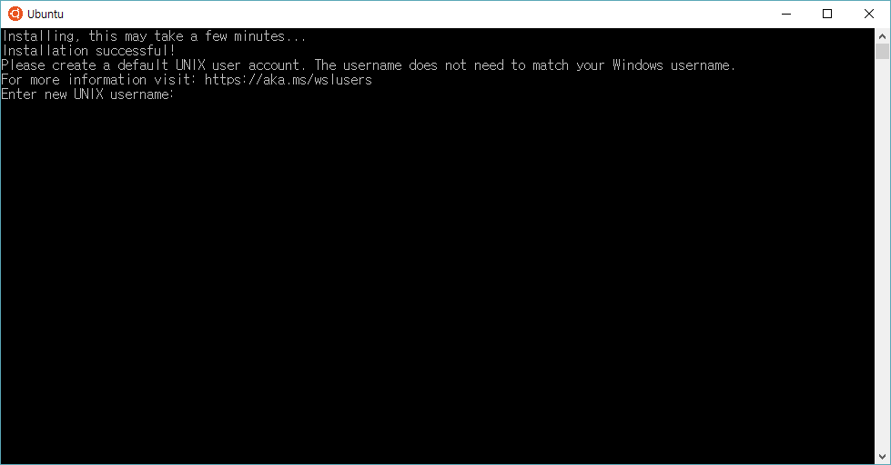
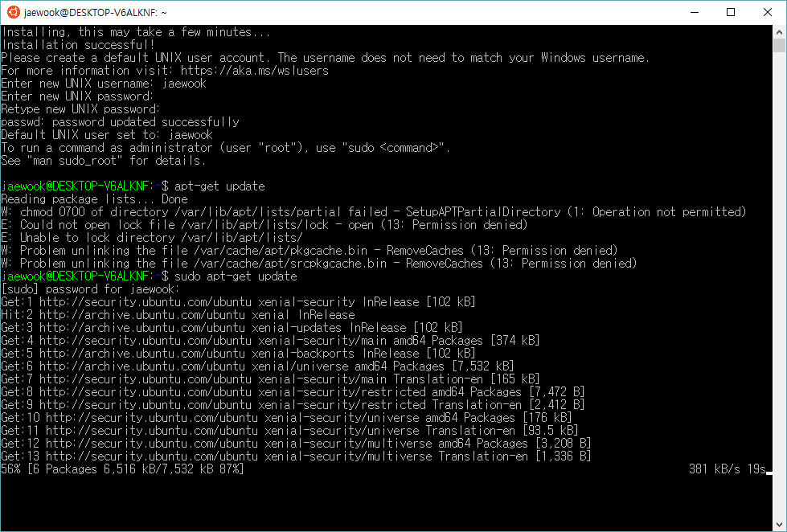
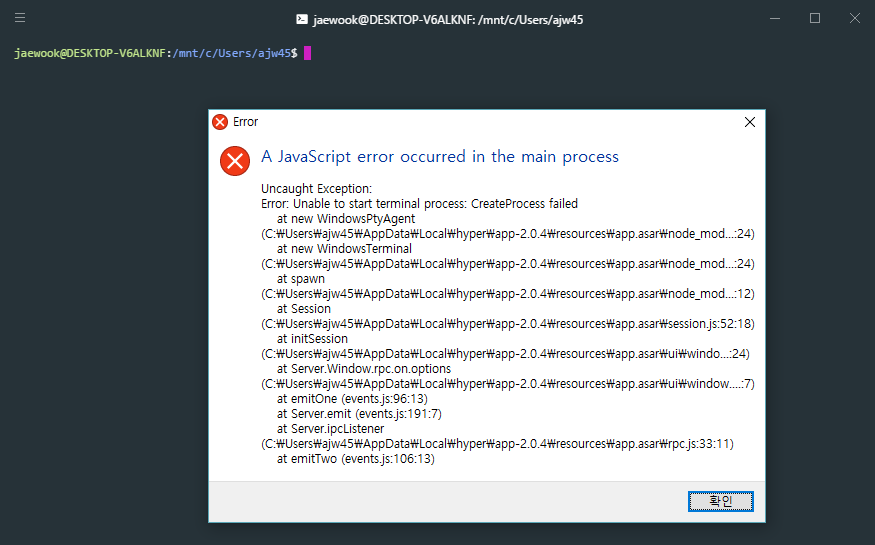

Windows 10의 출시 후 MS가 Windows 위에서 리눅스 Bash를 지원한다는 소식을 들은 지 거의 1년이 넘은 것 같다. 그동안 정식이 아닌 베타에 한에서 사용할 수 있었던 **WSL**(Windows Subsystem for Linux) 기능을 얼마 전 이루어진 WIndows 10 Fall Creators Update 이후 정식으로 지원한다는 소식을 듣고, 윈도우 상에서 어떻게 세팅을 하고 활용할 수 있는지 간단하게 적어보겠다.
  
## WSL 활성화하기

// 시작 메뉴에서 Windows 기능.. 과 같이 검색하면 바로 접근할 수 있다.
  
// 제어판에서 찾을 수도 있다.

Windows 10에서 Bash를 사용하려면 기본적으로 꺼져있는 WSL을 활성화해야 사용할 수 있다. `Windows 기능 켜기/끄기` 에서 `Linux용 Windows 하위 시스템`을 활성화한다. 재부팅을 해야 작동하니 재부팅도 한번 해주자.

## 리눅스 설치하기

다음으로 리눅스를 설치해야 할 것이다. Microsoft Store에서 자신이 원하는 배포판을 다운받아 설치하는 식이다. 베타때는 안그랬던 것 같은데 나름 배포판 3가지나 지원한다. 나는 `Ubuntu`를 설치할 것이다. 배포판 종류가 달라도 과정은 다 비슷할 것이다.

// Microsoft Store에서 `linux` 키워드로 검색하면 쉽게 찾을 수 있다.

// Linux, openSUSE, SUSE Enterprise 세 가지 배포판이 있다.

설치를 누르면 Application 형태로 배포판이 설치된다. 설치가 끝났다면 실행시켜보자. 최초 실행 시 스토어에서 설치가 끝난 줄 알았던....리눅스를 설치하고, 계정 설정을 하는 순서로 초기 설정이 끝난다.

// 설치하는데 시간이 꽤 걸린다. 다른 일 하다보면 끝날 것이다.

// 초기 설정이 끝난 후의 상태

만약 WSL을 활성화하지 않았다면 아래와 같은 오류 메시지가 뜰 것이다. [**WSL 활성화하기**](#wsl-활성화하기)를 참고하자.

`Ubuntu` 버전은 16.04로 설치가 되는 것 같다. 이제 리눅스의 코어 모듈을 윈도우 상에서 쓸 수 있게 되었다. 물론 `apt` 같은 패키지 매니저도 된다. 신기신기. 하지만 리눅스의 모든 기능을 쓸 수 있는 건 아니다. 어디까지나 _코어 모듈_ 만 지원하니, `GNOME` 같이 GUI 관련된 것들은 안된다고 보면 된다.

## Hyper에 적용하려면?

기본으로 WSL의 쉘은 `CMD`아 똑같이 생겼다. 
전 글에서 다룬 `Hyper`는 macOS를 기준으로 설명했는데, Windows용 Hyper에서는 `CMD`를 사용하게 된다. 하지만 macOS/Linux와 마찬가지로 `.hyper.js`파일을 이용해서 Windows에서도 PowerShell이나 Bash로도 쉘을 바꿔줄 수 있다.
  

// Full Path로 적어야 한다. 안그러면 오류가 격하게 반겨줄 것이다.
  
// 친절한 Hyper는 주석에 어떻게 해야하는지 다 써놨다.

신기한건 Bash Shell의 path를 `ubuntu.exe` 가 아니라 system32 아래에 있는 `bash.exe`로 지정해 준다는 점이다. _"한 시스템에 여러 배포판을 설치해도 저걸 공유해서 쓰나?"_ 라는 생각이 들었다. 궁금증이 귀찮음을 이긴 사람이 해보는걸로.

// Windows와 Linux 명령어 둘 다 쓸 수 있다.
  
// WSL의 루트 디렉토리와 드라이브의 루트 디렉토리는 다르다. WSL이 독립적인 하나의 시스템이라고 생각하면 이해하기 편하다.
  
// 기본적으로 루트 디렉토리는 `/mnt/{partition-letter}` 로 접근할 수 있다. ex) `cd /mnt/c/`

### !!! 아직까지 Hyper와 같이 쓰는건 좀 무리인 듯 하다.
내가 간단하게 적용해서 써본 결과 단지 _"이게 되긴 하구나"_ 정도로 봐야 정신건강에 좋을 듯 하다. 왜냐면..

// 새 탭을 열려고 했더니 오류..

제대로 동작하는 플러그인이 없어서..오류가 넘쳐난다. 대부분이 macOS, Linux 친화적인 플러그인들인데, 그나마 잘 동작하던 Windows 호환 플러그인조차 애러가 넘친다.  
탭 기능 포기하고 자잘한거 포기하면 쓸 수는 있다. ~~예쁘니까 용서해라~~

## 활용 예시

Windows 용으로 있던 `Chocolately`같은 Package Manager를 사용하지 않고 apt를 사용하여 리눅스용 패키지를 설치해서 사용할 수 있다. Windows 위에서 Linux 바이너리를 실행하는 것이다! 반대로 Bash에서 Windows용 바이너리를 실행할 수도 있다! WSL을 이용해서 윈도우와 리눅스 사이에 호환성 문제를 (전부는 아니지만) 어느정도 해결할 수 있다고 볼 수 있겠다.  
다시 말하면, Windows 상에서 `.exe` 파일로 하나하나 설치해야 했던 것들을 패키지 매니저를 통해서 손쉽게 설치 & 업데이트를 할 수 있게 된 것이다. 매우 마음에 든다. `PuTTY` 대신 `ssh`를 쓴다거나 하는 다른 방법도 있고, 나는 일일이 설치해야 했던 라이브러리와 프로그램 등을 WSL상에서 설치하고 개발툴에 적용해서 쓰려고 한다.  
`Linux` 용으로 있던 바이너리를 윈도우 상에서 별다른 수정 없이 쓸 수 있어서 WSL을 활용한다면 유용할 것이다. 반대로 윈도우용 바이너리도 `Linux` 바이너리와 수정 없이 쓸 수 있다. 와우. 활용할 수 있는 것들이 많을 것 같다.

Node.js를 Windows에서 apt로 설치할 수 있는 날이 올 줄이야..

// npm 은 PATH가 꼬인듯 하다.

## 결론

난 터미널 때문에 윈도우를 못썼는데 이제 WSL이 어느정도 지원을 해주니 윈도우에서 개발을 해도 나쁘지 않을 것 같다는 생각이 들었다. 타 OS의 장점이던 기능을 아예 자기 것으로 만들어버리는 전략은 탁월한 선택인 것 같다. 가상 머신을 이용해야만 했었는데 이런식으로나마 호환성 문제가 해결이 되면서 OS를 선택할 때 Windows를 선택할 긍정적인 이유가 하나 늘었다고 생각한다.  
`Hyper`에서의 지원은, WSL을 설치하면 Linux에서 되던 플러그인들이 동작할 수 있을지 약간 기대했지만 WSL이라고 동작하진 않았다. 아직 윈도우에서 `Hyper`를 쓰기는 안되는 플러그인들이 많아서 조금 힘든 것 같다. _(뭐 그래도 `CMD`보다는 낫지만)_