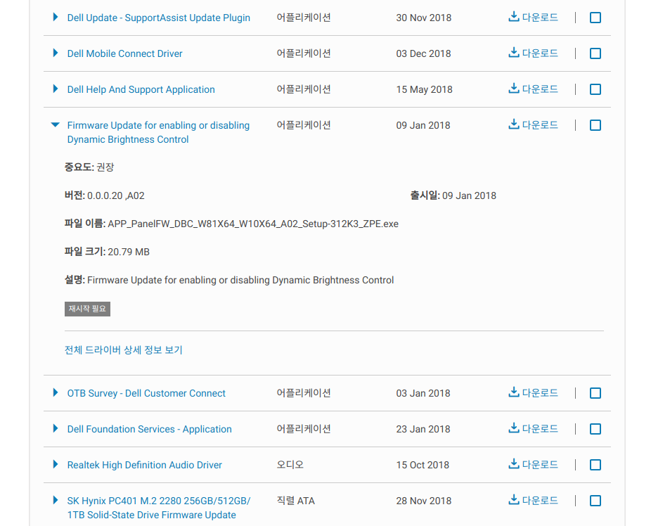

# Dell XPS 13 9360

몇 달 전에 쓰던 맥북 프로 15인치를 중고로 처분하고 델 XPS로 넘어왔습니다. 노트북을 바꾼 데에는 여러 이유가 있었지만, 원래 쓰던게 2012년 모델이라 너무 느려서 바꾸게 됐습니다. (마침 지인이 싸게 팔길래..) 아무튼, 이 노트북을 나름 만족하며 잘 쓰고있었는데, 눈에 거슬리는 문제가 하나 있었습니다.

# 정말로 눈에 거슬리는 자동밝기

별로 신경을 안쓰는 사람들도 많겠지만, 저는 특히 눈이 예민한 편인데 노트북의 밝기 설정을 해도 **어두운 화면에서는 최대 밝기도 너무 어두워**보이는 현상이 있었습니다. 물론, 밝은 화면에서는 더 밝아집니다. 그래서 알아보니 제가 쓰는 델 XPS 13 9360 모델은 Dynamic Backlight Control, DBC인지 뭔지 하는 기능으로 추정되는 게 있었습니다. 밝을 때는 상관없는데, 보통 작업을 어두운 테마의 프로그램에서 주로 하다 보니 밝게 보여야 할 글자까지 어둡게 보이는 문제가 발생했습니다. 델은 과연 이걸 기능이라고 만들어 넣어둔 것인지..

# 버그 잡기, 아니 기능 끄기는 생각보다 귀찮다.

이 버그같은 기능을 끄려면 모니터의 펌웨어를 수정해야 한다고 [델 사용자 포럼](https://www.dell.com/community/Laptops-General-Read-Only/XPS-13-9360-vs-Dynamic-Contrast-Brightness/m-p/5148632)에 나와있었습니다. 저만 불편하다고 느낀 게 아니었습니다..! 링크에 나와있는 내용을 살펴보면 DBC를 enable/disable 해주는 프로그램이 있다는 존재를 알 수 있는데 아쉽게도 윈도우 전용입니다. 저같이 리눅스 쓰는 사용자는 윈도우를 설치해서 디스플레이 펌웨어 패치를 해야 하는 것 같았습니다.

> [델 드라이버 다운로드 사이트 링크](https://www.dell.com/support/home/kr/ko/krdhs1/product-support/product/xps-13-9360-laptop/drivers)

위 링크에 접속해서 "Dynamic ~" 의 키워드로 찾다 보면 아래와 같은 드라이버가 하나 나옵니다.

이 프로그램으로 거지같은 DBC 를 disable 하면 어두운 화면에서도 밝은 화면을 볼 수 있습니다. 이제 모니터 화면이 어두워서 스트레스 받을 일은 없겠습니다. 이거 하나 끄려고 잘 안쓰던 윈도우도 굳이 설치하게 만드는 델이란..(이런 기능을 왜 펌웨어 안에 넣어놨는지 의문일 뿐)