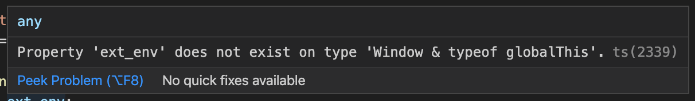

## TL;DR

`src/react-app-env.d.ts` 파일에 `Window` 타입을 정의해서 쓰자.

---

타입스크립트를 사용하는 create-react-app 으로 만든 프로젝트에서 `window` object 를 확장해야 하는 경우가 꽤 많다. 하지만 까다로운 TS typechecker 는 `window` object에 우리가 사용하려는 `property`가 없다면서 컴파일도 안시켜준다.



이 문제로 구글링을 하다보면 보통 솔루션으로 나오는 방법들이 몇가지 있다. 아래는 그중에 몇가지 예시이다.

### 1. (window as any).(property)

이건 `window` object를 any 타입으로 만들고 `property` 에 접근하는 방법인데 TS를 쓰는 이유인 타입체킹이 안되니 좋은 방법이라고 생각하지 않는다.

### 2. .d.ts 정의

```ts
export {}

declare global {
    interface Window {
        property: SomeType;
    }
}
```
global.d.ts Sample Code

보통 위와 같이 타입 정의를 해서 window object 를 확장하는데 다른 프로젝트에서는 작동할지 모르겠지만 CRA 기반 앱에선 어림도 없다. 여전히 똑같은 오류가 발생한다. 나도 처음엔 저렇게 하면 동작할 줄 알았는데 왜 안될까 생각하다가 tsconfig typeRoot 도 의심해보고 이것저것 해봤지만 안됐었다.

## 솔루션: CRA에선 react-app-env.d.ts 이용

그러던 중 [이 블로그](https://dev.to/louisgv/typescript-and-create-react-app-env-136e)에서 관련 내용을 보게 되었고, 그동안 `react-scripts start` 를 하면 좀비처럼 생기던 `react-app-env.d.ts` 의 존재 이유를 알게 됐다.

```ts
/// <reference types="react-scripts" />
interface Window {
    property: SomeType;
}
```

이 파일에서 `window` object의 타입을 정의해주면 타입을 인식하고 컴파일이 잘 된다. 휴😓

그런데 여기서 한가지 의문점, 보통 타입 정의 파일들(`*.d.ts`)은 `/types`나 `/typing` 아래 놓는데 굳이 왜 `src` 폴더 안에 파일을 생성되도록 해놓은 걸까? 글을 적는 지금 이 시점까지도 해당 이슈에 대해서 개발자가 옵션을 줄 수 있게 해달라는 내용의 Issue 가 토론 중이다. 아무쪼록 좋은 쪽으로 개선됐으면 한다.