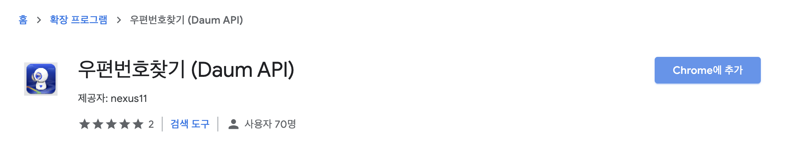
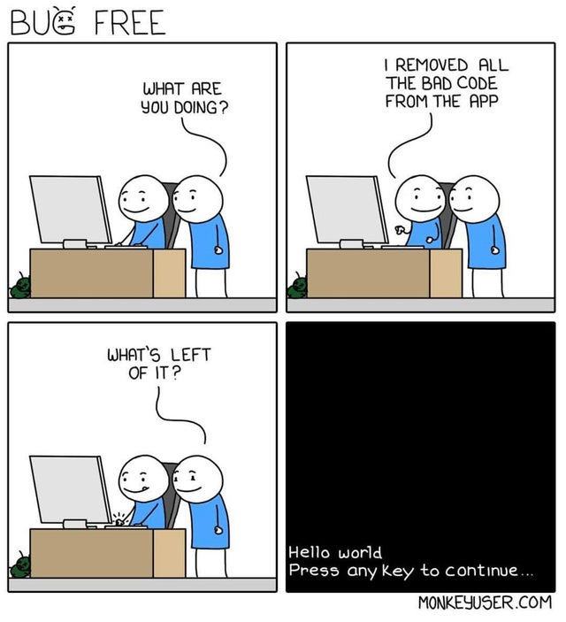
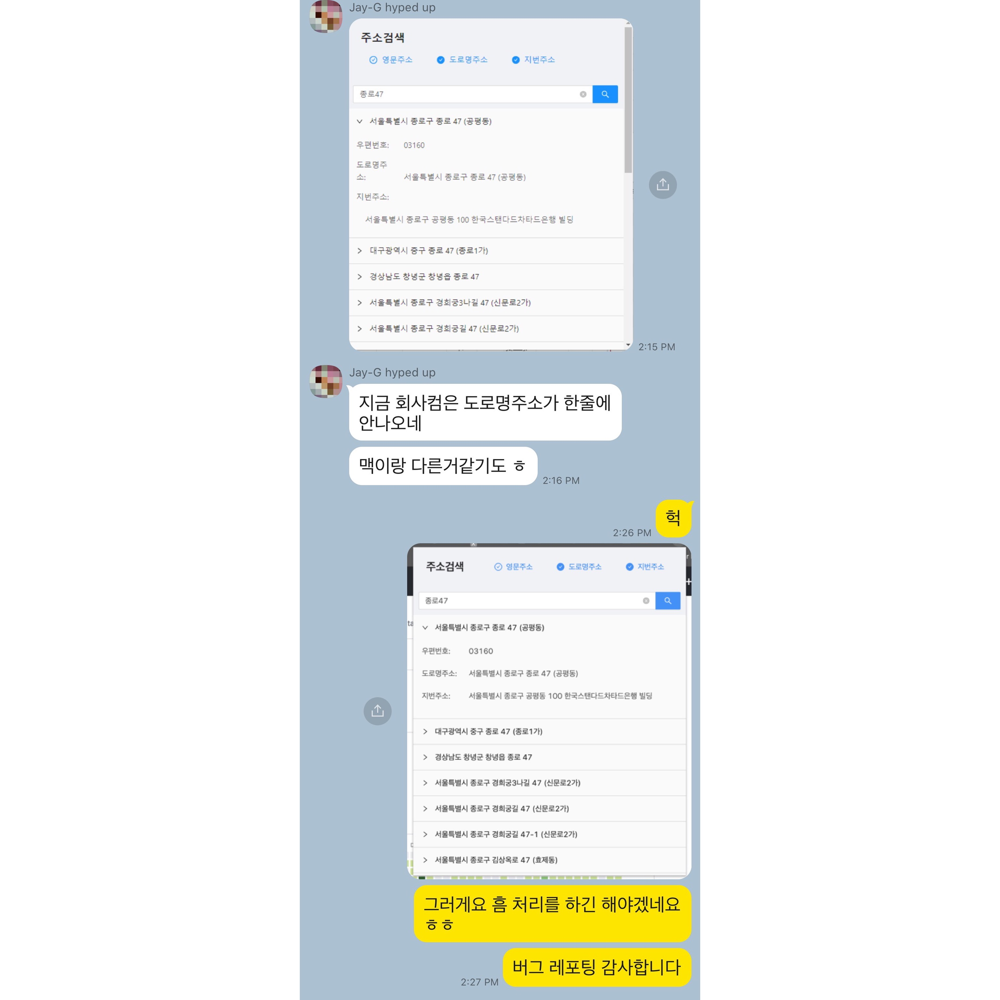
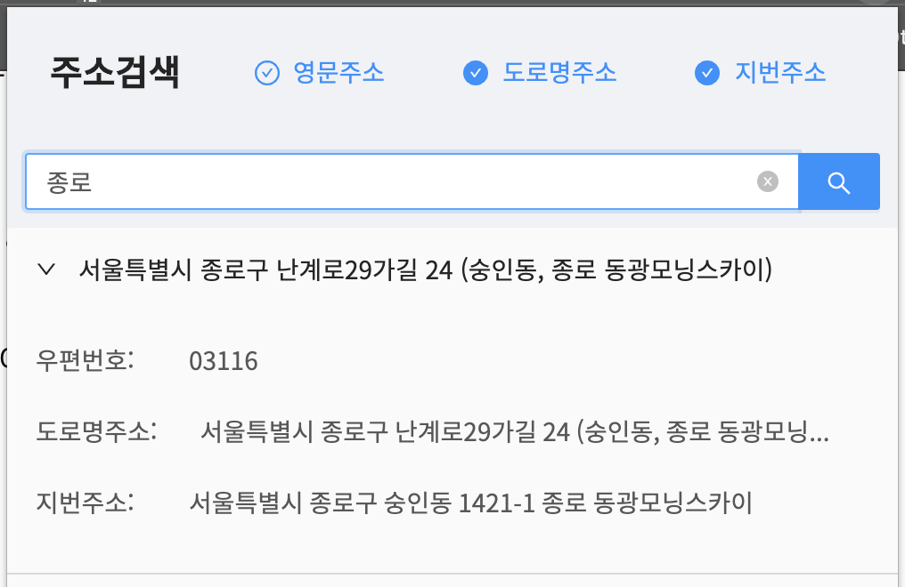
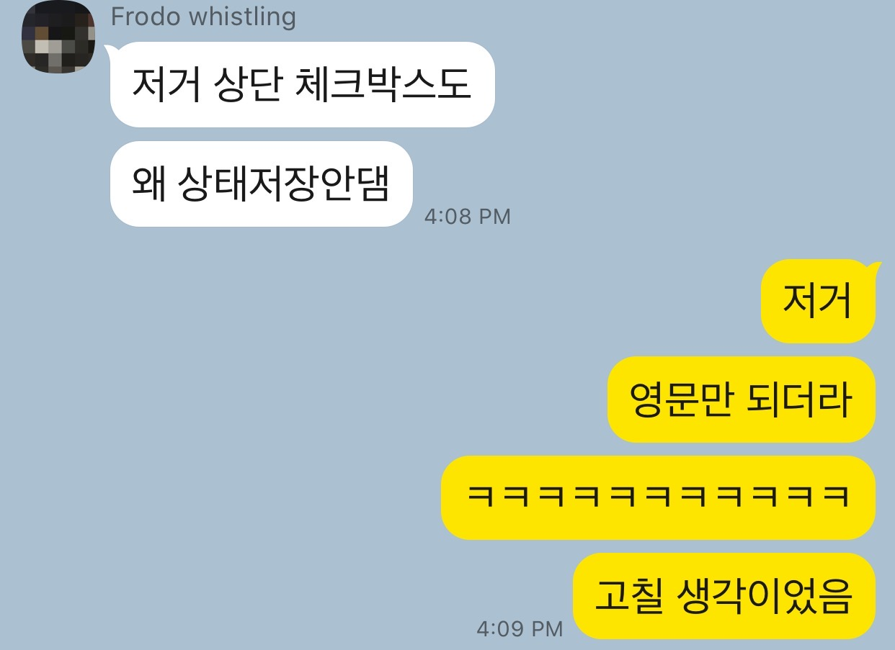
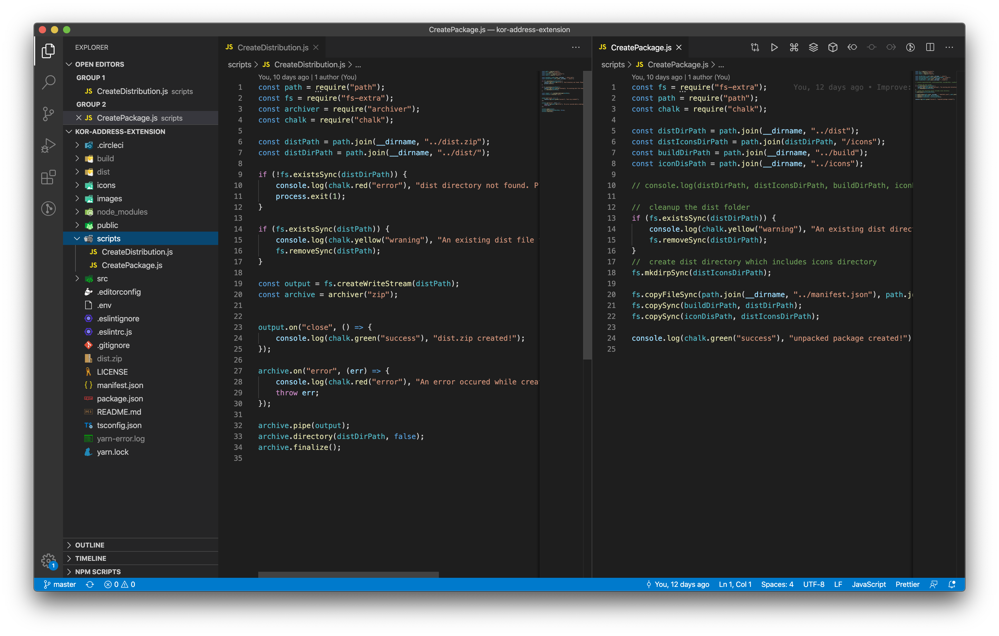
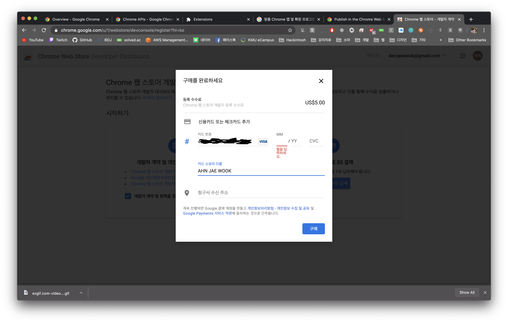
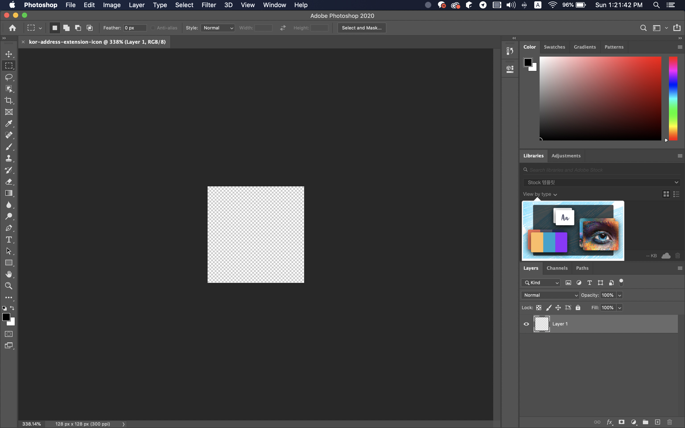
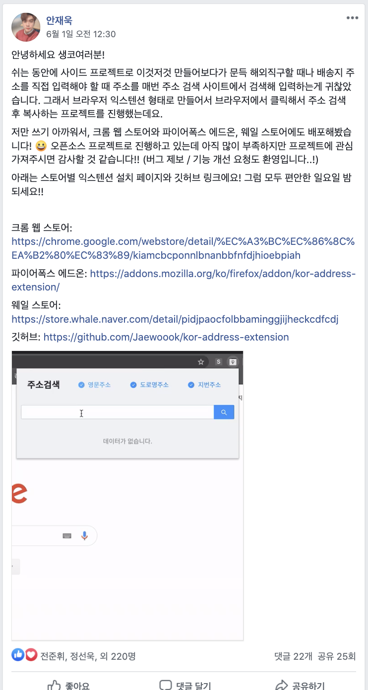
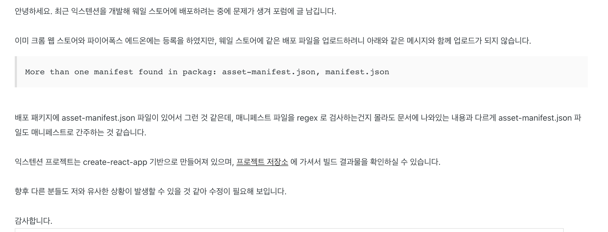

## 들어가며

사실 난 이전에도 크롬 익스텐션을 몇 번 만들어봤다.
하지만 대부분 귀찮아서 만들다 말거나, 개인용도로만 썼다.
사용자층도 한정적이고 기능이나 코드 품질이 낮아 솔직히 어디 내놓고 불특정 다수가 쓸 수준이 못 된다라고 생각했으니 말이다.
그러다가 지금 이 글이 쓰여지는 블로그의 도메인 구입을 위해 Porkbun 이라는 곳에서 도메인을 구입하다가 카드 결제를 위해 영문 주소를 입력해야 했다.
왜인지는 모르겠지만 나는 영문 주소를 매일 까먹는다.
그래서 매번 영문 주소를 검색하곤 하는데 이게 꽤 귀찮더라.
이 불편함을 익스텐션을 만들어서 해결할 수 있을 것 같아 익스텐션을 만들어야겠다고 생각했다.

## 내가 했던 생각은 누군가가 거의 한번쯤 해봤을 생각이다.

익스텐션을 만들어야겠다고 생각하고 나서 바로 한 것은 크롬 웹 스토어에 만들려는 익스텐션의 키워드로 검색해보는 것이었다.
왜? 내가 한 생각은 이미 다른 사람이 해봤을 가능성이 크고, 이미 누군가 잘 만들어 놨을 수도 있으니까 만약 검색해서 찾으면 그걸 쓰는게 더 편할거다.

그래서 열심히 검색하던 중...

(그리고 비슷한 익스텐션 하나 발견함)

역시나 나보다 먼저 생각한 사람은 있었다. 검색하길 잘했다.
하지만 마지막 업데이트 날짜를 보니 거의 6년 전 이었고, 버전도 1.0 인 것으로 미뤄봤을 때 아마 처음이자 마지막 릴리즈가 아니었을까 라는 생각이 들었다.

내 검색 능력으로 찾은건 이것밖에 없어서, 내가 잘 만들면 더 좋을수도 있겠다라는 생각에 작업을 시작했다.

## 가장 중요한 주소 검색은 어떻게 구현할까?

일단, 인터넷에 *영문주소변환* 등의 키워드로 검색하면 웹서비스들이 많이 나오는 것으로 보아 어디선가 API를 제공해줄 것이라고 생각했다.
그리고 몇가지 API를 찾았는데,
첫번째는 [행정안전부 도로명주소 API](https://www.juso.go.kr/addrlink/devAddrLinkRequestGuide.do?menu=roadApi)였고,
두번째는 [카카오 우편번호 서비스](http://postcode.map.daum.net/guide),
마지막으로 [Postcodify](https://www.poesis.org/postcodify/)라는 오픈소스 기반 도로명주소 검색 API 였다.

모든 API를 다 검토해본 결과 **행정안전부 도로명주소 API**를 사용하기로 했다. 아무래도 행정안전부가 관리하는 서비스라는 생각을 하니 주소 DB도 제일 최신일거고, API도 잘 되어있었기 때문이다.

## 기능 구체화, 간단한 디자인 구상하기

본격적인 개발에 들어가기 앞서 구체적으로 어떤 기능이 필요하고, 개발해야 하는지와 완성하고 난 뒤 어떤 모습일지를 구상하고 개발에 들어가야겠다고 생각했다.
사실 이떄까지 아이디어만 있고 구체적으로는 한번도 생각을 안했었기 때문에 무조건 짚고 넘어가야 하긴 했었다.

생각했던 것들을 대략적으로 정리하자면,
- 컨셉은 **심플, 사용성**에 초점을 맞춤
- 주소를 검색하는 이유는 어딘가 복사해야 하기 위한 목적이 크니까 **복사기능** 지원 필요
- 어떤 주소가 필요할지 모르니 간단한 필터를 둬서 **도로명/지번/영문 주소**를 표시
- 매번 주소 검색하려고 어디 접속하는게 귀찮으니 **팝업 혹은 현재 보고있는 웹에 포함** (팝업이 적정선인 것 같아서 팝업 방식 선택)
- 광고같은거 당연히 없어야 함 (나도 쓸건데 광고 달리면 짜증나므로)
- UI는 가독성이 좋아야 하고, 관심없는 정보는 최대한 노출 덜 시키도록

화면 구성도 대략적으로 내 머릿속에만 있고, 모호한 부분도 많아 헛점 투성이지만 그냥 나머지는 개발하면서 생각하기로 했다.

## 개발하기

사실 예전에 개인용도로 쓸 크롬 익스텐션을 개발하면서 익숙한 구성으로 익스텐션 보일러플레이트를 만들어놨다.
간단하게 *CRA(Create React App) + TypeScript + content script + background script* 구성인데, 빌드랑 패키지 스크립트를 작성해놨기 때문에 이걸 활용해 개발을 시작했다.
그리고 인터페이스는 [ant-design](https://github.com/ant-design/ant-design) 을 이용해 작업했다. 내 기준에서 무난하게 깔끔하고 리엑트 지원에 라이브러리 커뮤니티도 컸기 때문에 별다른 고민은 없었다.
디자인도 ant-design 만 쓰다 보니 (내 기준으로) 깔끔한 것 같아서 간격 정도만 조정했다. ant design 짱!

구성은 간단하다. 모든걸 popup 에 넣으면 됐다.
검색어 입력창, 검색 버튼, 검색 결과 필터 버튼, 검색 결과 표시 영역 만드는데 반나절도 걸리지 않았다.

### 이슈 해결하기

대략 프로토타이핑을 하고 나서, 주변 지인들한테 보여주고 피드백을 받았다.
그런데 이 작은 프로젝트에 생각보다 이슈가 많이 나왔다.

#### 1. Font & Layout

맥북에서 모든 작업을 해서 *"음~괜찮네"* 라는 생각을 할 때쯤, 윈도우를 사용하는 지인 분이 윈도우에서 좀 이상하게 보인다는 제보를 해주셨다.

(역시 지인찬스 최고..!)

확인해보니 **font-family 가 시스템 기본값**으로 설정되어 있어서 맥과 윈도우 간에 차이가 생기는 것이었다.
그리고 팝업 가로 500px 로 설정했는데 주소가 길어지다 보니 개행처리 돼서...나의 멍청함이 돋보이는 순간이었다. (멍청멍청)

**솔루션 1:**
우선 폰트를 Noto Sans KR 로 고정했다.
별다른 이유는 없고 제일 깔끔했다.
폰트 파일을 프로젝트에 포함시켜야 할지, 웹폰트를 import 할지 고민했는데 어차피 검색이 가능한 환경이라면
(즉, 익스텐션을 사용할 수 있는 환경이라면) 인터넷 연결이 되어 있을 거라서 프로젝트 크기를 줄이기 위해 웹폰트 import 방식을 택했다.

**솔루션 2:**
레이아웃 간격을 조정하고 주소가 너무 길어질 때 ... 으로 나타날 수 있게 줄임표 처리를 했다.
ant-design css 에 text ellipsis 가 되는 컴포넌트가 따로 있어서 저 부분은 디버깅하며 스타일을 직접 수정했다.

#### 2. 검색 결과 필터가 이상함

알면서도 모르는 척 했던 (아니 사실 모르고 싶었던..) 검색 결과 필터 버그도 제보해줬다.

이 이슈랑 같이 옵션 값을 저장하는 storage 컨트룰 코드가 이상해서 전반적으로 수정이 필요한 상황이었다.

**솔루션:**
storage 관련 작업을 관리해주는 SettingsManager 라는 것을 만들었다.
브라우저 storage 가 빠른 듯 했지만 딜레이가 있고, promise 같은 것도 지원을 안하고 구조적으로 사용하기 불편했다.
그래서 queue 기반 storage 컨트룰러를 만들어서 적용하니까 관련된 문제가 해결됐다.

#### 3. Windows 환경에서 개발이 힘듦
집에서 데스크톱으로 작업하려다가 프로젝트를 클론받고 실행하려니 맥에선 명령어만 입력하면 됐던 일들이 Windows에선 여기저기 삐걱거렸다.
패키지 작업이 귀찮은데 테스트하려면 계속 수동으로 패키지 작업을 해줘야 했다.
그래서 플랫폼 상관 없이 원하는 작업을 일관되게 실행하는 방법에 대해 고민했다.

**솔루션:**
원래는 shell script 를 **package.json** 파일에 입력해뒀는데, **자바스크립트 기반 package script 를 scripts 라는 폴더 아래 작성해놓기로** 생각했다.
이렇게 스크립트 형태로 작성해 놓으면 node 가 돌아가는 환경에서 Shell 명령어와는 다르게 플랫폼 상관 없이 실행될 수 있게 되었다.

스크립트를 작성하고 나니, 큰 프로젝트들이 왜 별도의 scripts 를 갖고 있었는지 이해할 수 있었다.

## 크롬 웹 스토어에 올리기

프로젝트 시작부터 대략 10일 정도의 시간이 흐르고, 공개할만한 형태가 갖춰져 스토어에 배포하기로 했다.
처음에는 크롬 웹 스토어에만 배포할 생각이었는데 이게 개발자 등록을 해야 된다고 한다.

### 개발자 등록

아주 예전에 Google Play 개발자 등록을 해서 이미 개발자 등록이 된 줄 알았는데, Web Store 개발자 등록을 또 따로 해야 됐다.
다행인건 **등록 비용이 5달러**로 구글 플레이보다 상대적으로 비용은 저렴하다. 한 번 등록하면 20개까지 익스텐션을 올릴 수 있다고 한다.
앱의 갯수에 제한을 왜 거는지 이해가 잘 되진 않지만 ***"뭐, 20개까지 만들겠어?"*** 라는 생각으로 결제했다.

그런데 국가 선택하는 부분에 대한민국이 선택지에 없어서, 어쩔 수 없이 다른 나라를 선택할 수 밖에 없었다.
왜 그런지는 검색해도 최신 자료가 없어 알 수 없었다. (심지어 구글 문서에도 없음)

### 나 개발자. 디자인 무섭다.

그리고 스토어에 업로드하려고 보니 크게 잊고 있던게 생각났다. 바로 **앱 아이콘**.
심지어 상세 이미지도 하나 필요하다고 한다. 사이즈는 1200 x 800 이다.
누구한테 부탁하기도 애매하고, 이왕 내 힘으로 하는거 필요한 이미지도 내 힘으로 만들어보자는 생각에 무작정 일러스트와 포토샵을 설치했다.

(학교 과제할 때 몇번 써본게 끝인데...너무 무서웠음)

툴을 배우면서 작업해서 그런지 작업시간은 하루정도 걸렸다.
솔직히 상세 이미지는 너무 대충 만들어서 올리기 부끄럽다.
대한민국 주소 검색 익스텐션이라 인터넷 브라우저 같은 프레임 안에 한국지도 넣고, 지도 마커같은거 그리면 되겠다! 라는 생각으로 작업했다.

작업을 다 하고 새삼 디자이너분들이 대단하게 느껴졌다 👍

## 홍보하기

모든 조건을 간신히 달성하고 나서 심사 요청 후, 다음날 승인이 됐다.
내 주변에서는 *"내가 이러이러한 걸 만들었는데 써주세요."* 같은 말을 해서 사용자가 있긴 했는데, 이왕 배포한거 많은 사람들이 써주면 좋을 것 같았다.
그리고 어딘가엔 나와 같은 불편함을 느끼는 사람들도 불편함을 해결할 수 있으니까 누구에게라도 도움은 될 것 같았다.

그래서 페이스북 **생활코딩** 그룹에 프로젝트를 소개하는 게시물을 올렸다.

다행히도, 악플은 없었다. (사실 되게 조심스러웠다.)
확실히 커뮤니티에 홍보를 하고 크롬 웹 스토어 기준 사용자가 많이 늘어났다.
그리고, 작업물을 좋게 봐준다는 것 만으로도 너무 감사하고 뿌듯했다.

### 지원 플랫폼 확장

그리고 얼마 되지 않아 네이버 웨일팀에서 메일이 왔는데, 웨일 스토어에 올려달라는 내용이었다.
생각해보니 네이버 웨일 스토어에 게시를 하게 된다면 웨일 브라우저 사용자는 한국인이 대부분일테니 더 많은 사람들이 유용하게 사용할 수 있을 것 같다고 생각했다.
아, 웨일 브라우저는 크롬 API를 거의 대부분 호환하고 있어서 별다른 소스 수정 없이 동작하는 데에 문제가 없었다.

그리고 파이어폭스 에드온으로도 소스 수정을 거의 안하고 쉽게 만들 수 있다는 내용을 알게 됐는데, 아예 다른 플랫폼에 등록하는 김에 웨일과 파이어폭스 모두 지원하기로 했다.
이 과정에서 WebExtenson API 표준을 알게 되고, 크롬 기준에 맞춰져 있던 프로젝트 코드를 WebExtension API에도 호환되게 약간의 작업도 했다.

그렇게 AOM(파이어폭스 웹 스토어)에 업로드하고, 웨일 스토어에도 업로드까지 완료하며 총 세 브라우저 플랫폼을 지원하게 됐다.

(웨일 스토어에 업로드가 안돼서 소소한 버그 제보도 했다.)

## 개발 후

감사하게도, 현재까지 다운로드 200회 이상을 기록하고 있다.
생각했던 것보다 훨씬 많은 사람들이 관심을 가져줘서 신기하고 뿌듯했다.
[GitHub 레포지토리](https://github.com/Jaewoook/kor-address-extension)에도 개발자분들이 스타도 눌러줬다.
내 레포지토리에 스타 받아보는건 처음이었다. 아무래도 주접은 여기까지 떨어야겠다.

다음 오픈소스는 조만간 위에 잠깐 말했던 SettingsManager 라는 것을 더 다듬어서 storage 를 좀 편하게 쓸 수 있는 utility package 로 만들어서 배포해 볼 생각이다.
그저 개발하는게 즐겁고, 작업한 프로젝트가 관심받으면 좋아하고, 더 편하게 살기 위해서 개발자스럽게 해결하려는 나는 어쩔 수 없이 개발자가 될 운명이구나 라는 생각이 들었다.