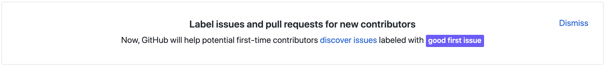
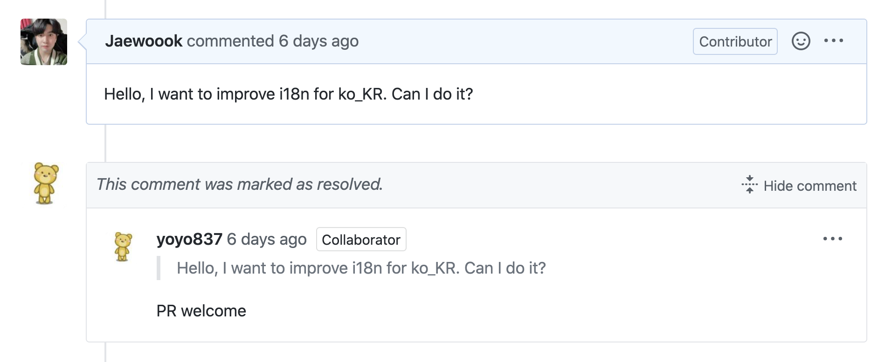
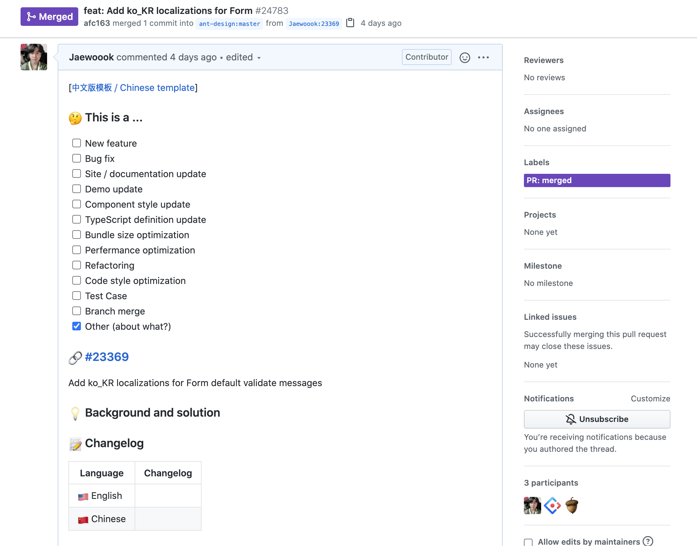
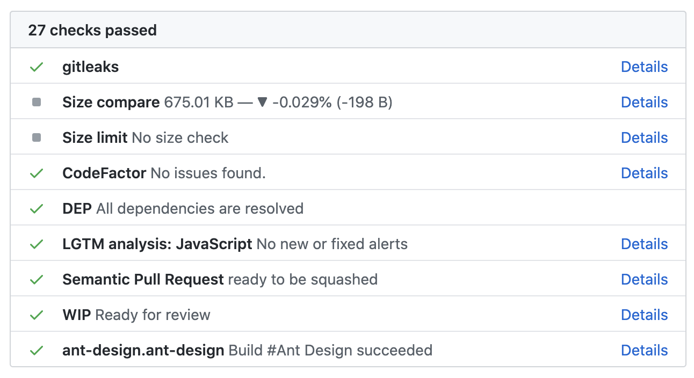
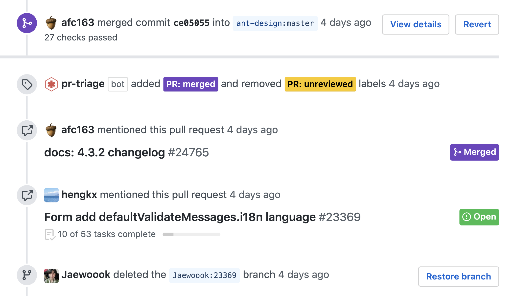
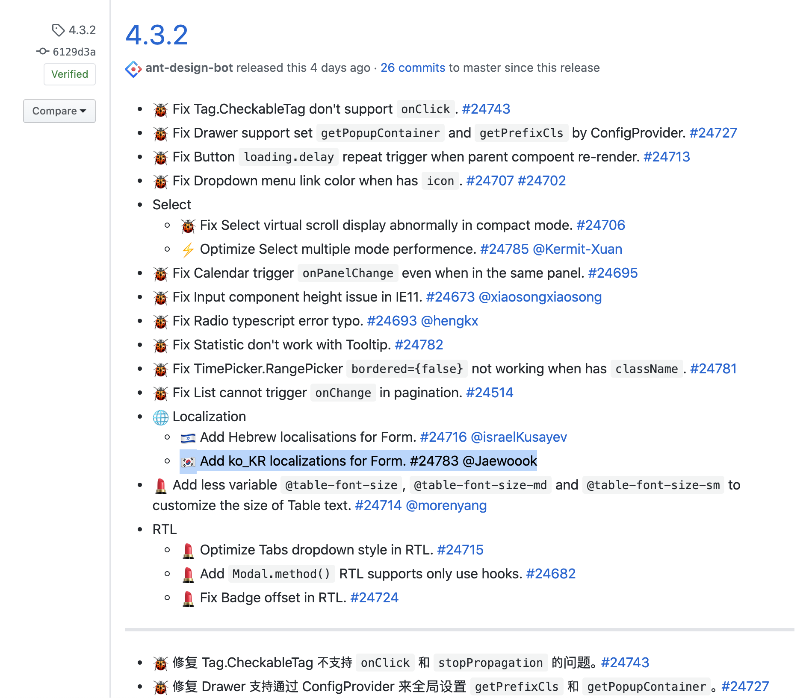

올해는 다른 해와 다르게 안하던 것들을 참 많이 한 것 같다.
백수가 되면서 그동안 다양한 핑계와 이유로 미뤄오던 것들을 더이상 미룰 핑곗거리가 없어서 하나씩 하고 있다.
그 중에 하나가 오픈소스에 기여해보기 였다.
그래서 최근에 이 목표를 이루기 위해 내가 어떤 과정을 거쳤는지 개인적인 기록용 혹은 이 글을 볼 누군가에게 조금의 도움이라도 될 수 있었으면 하는 마음에 글로 남겨본다.

## 🔍 기여할 프로젝트 찾기

다른 글에서도 보통 이 주제부터 이야기를 하는 것 같고, ***"나도 오픈소스에 기여하고 싶다!"*** 라는 생각을 한 후에 제일 먼저 ***“그럼 어떤 프로젝트에 기여해야 할까?”*** 라는 생각부터 했었기 때문에 이 주제부터 이야기를 해야 할 것 같다.

개인적으로 나는 기여할 오픈소스 프로젝트를 찾을 때 몇 가지 단계를 거쳐 내가 작업하기 적합한 프로젝트를 찾았다.

1. 자주 쓰는 오픈소스에는 뭐가 있었지?
2. 나에게 익숙한 언어로 작업되는 프로젝트 중에 유명한게 뭐가 있을까?
3. 내가 지금까지 했던 작업들이랑 비슷한 프로젝트가 뭐가 있을까?

위 질문에 대한 답을 생각하다 보니 각 질문에 대한 답을 할 수 있었다.

1. 자주 쓰는 오픈소스에는 뭐가 있었지?
    - React, TypeScript 관련된 여러 프로젝트들
2. 나에게 익숙한 언어로 작업되는 프로젝트 중에 유명한게 뭐가 있을까?
    - 1번과 거의 겹침 (유명한 프로젝트를 자주 사용하기 때문에, 유용해서.)
3. 내가 지금까지 했던 작업들이랑 비슷한 프로젝트가 뭐가 있을까?
    - [malta](https://github.com/salesboostio/malta.git) 라는 UI 컴포넌트 라이브러리를 만들었던 경험
    - 브라우저 확장 프로그램을 개발했던 경험

대충 이렇게 질문에 대한 답이 나오고, 마침 [kor-address-extension](https://github.com/Jaewoook/kor-address-extension) 프로젝트를 할 때 [ant-design](https://github.com/ant-design/ant-design)을 썼던 기억이 났다.
그래서 무작정 ant-design 레포에 가서 내가 할만한 작업이 있나 기웃거리기 시작했다.

뭔가 조금 갑작스럽긴 하지만 내가 유용하게 잘 사용하던 프로젝트에 기여하면 뿌듯할 것 같았다. 그래서 이렇게 기여할 프로젝트 찾기는 마무리됐다.

## 💡 어떤 작업을 해야 할까?

어떤 프로젝트에 기여할지는 정했지만 아직 내가 생각해야 할 것들은 많았다. 막상 어떤 작업을, 어디서부터 시작해야 할지 몰랐기 때문이다.

실제로 이게 제일 어려웠다.
이 거대한 프로젝트에 어느 부분에서 당장 무엇을 할 수 있을지 생각해보니 아무것도 떠오르는 게 없었기 때문이다.
그래서 무작정 repository issue 를 훑어보기 시작했다.

### good first issue, 그저 빛 ✨

다행스럽게 나같은 사람은 세상에 많았나보다.  
그래서 깃허브에서 처음 프로젝트에 기여하는 사람들을 위해 **good first issue** 라는 label을 만들어 두었다.
**good first issue** label 을 필터에 적용해보면 해당 label 이 붙어있는 issue 들을 찾을 수 있었다.
물론 label 이 붙어있지 않거나, 해당 label 로 issue 가 없는 프로젝트도 충분히 있을 것이다.
그런데 ant-design 프로젝트는 good **first issue** 에서 적당한 issue 를 찾을 수 있었다.

### 👨‍💻 내가 작업할 내용

아직 방대한 프로젝트 코드에 직접 기여하는 것은 무리라고 생각되었다.
그래서 마침 i18n help wanted 라는 내용의 이슈가 있길래 한국인으로서 할 수 있는 적절한 (그야말로 good first issue) 작업이라고 생각되어 하기로 마음먹었다.

그리고 혹시나 하는 생각에 thread 에 한국어 번역 작업을 시작해도 되는지 물어봤다.
(괜히 작업 다 했는데 안된다고 하면 허무하기도 하고, 윗 thread 에 다른 사람들도 물어보길래 나도 물어보는게 좋겠다고 생각했다.)
다행히 PR welcome 이라는 답변이 달려서 신나게 작업을 시작할 수 있었다.

### 📚 작업 전에 참고해야 할 것들

보통은 프로젝트마다 각기 다른 commit style 이나 workflow 를 가지고 있다.
그래서 나는 작업을 시작하기 전에 commit history 를 보면서 어떤 스타일로 커밋을 하는지, 브랜치는 어떻게 따야 하는지 등의 맥락을 파악했다.
아, 레포지토리에 **CODE_OF_CONDUCT**, **CONTRIBUTING** 같은 파일이 있다면 그 문서들을 무조건 읽어보는게 좋을 것이다.
방금 말한 문서들도 작업할 프로젝트에 있을 거라는 보장은 없지만 있으면 있는대로, 없으면 알아서 적당히 센스있고 깔끔하게 눈치껏 작업하면 되는거다.

## 👓 작업할 때 생각했던 것들

default validate error message 를 한국어로 번역하는 작업을 하는데, 새삼 한국어가 어렵다는 것을 느낄 수 있었다.
영어는 적당히 하면 되는데 한국어를 문장 형태로 번역하려니 *을/를*, *은/는* 등의 조사가 내 앞길을 가로막고 눈앞을 캄캄하게 만들었다.
처음엔 영어 메시지만 참고하면서 한국어로 번역했는데 이게 한계가 있다고 생각해서 일본어도 보고, 중국어도 보고, 러시아어도 보고... 기타 다른 나라 언어들 메시지 번역을 보면서 작업했다.
처음엔 단순하고 작은 작업이라고 생각했지만 나 혼자만의 작업이 아니라는 생각에 신중에 신중을 기하며 작업하는 나를 발견할 수 있었다.
결국엔 변수가 들어가는 템플릿 문자열이라 치환되는 변수가 문장에 어디쯤 있는지, 다른 언어들과 일관된 스타일을 유지하면서 한국어로 나타낸다고 생각하니까 나름 고민하던 부분을 해결할 수 있었다.

## 📝 대망의 Pull Request 작성하기

ant-design 프로젝트는 이미 수 많은 컨트리뷰터들이 작업을 하고 있고, 커밋 수만 따져도 2만 커밋이 다 돼가는 프로젝트라 Pull Request 를 올릴 때 PR TEMPLATE 이 있어서 내용을 작성하기 수월했다.
미리 적혀있는 체크 리스트를 확인하며 하나씩 체크하고, 혹시 몰라서 테스트도 한번 더 해보고, 드디어 Create Pull Request 버튼을 눌렀다!
웬지 모르는 가슴 쿵쾅쿵쾅은 덤이었고.

PR을 올리니 바로 여러 봇들이 자동으로 미리 지정된 task 들을 처리하기 시작했다.
나도 CI/CD 등을 붙여봐서 알지만 난 기껏해야 CircleCI, GitHub Actions, dependabot 정도밖에 붙여보지 않았는데 여긴 순식간에 5개 이상의 봇들이 붙어서 저마다의 역할을 수행하고 있었다.
그걸 지켜보는 나는 괜히 task 가 실패할까 긴장을 놓을 수 없었다.
갑자기 하나의 task 가 실패했다고 표시됐고, 내용을 확인해보니 **Semantic Pull Request** 항목이 부적합하다고 되어 있어 PR 이름에 type 을 붙여줌으로써 해결했다.

## 야호, Merged!

한 한시간쯤 지났나. 갑자기 메일이 왔다길래 확인해보니 PR 이 Merge 됐다는 내용이었다.
내 PR 을 merge 해준 사람이 외국인이어서 리뷰를 빡세게 해주진 못한 것 같지만, 아무튼 첫 PR 이 Merge 됐다.
기분이 묘하더라. 그리고 4.3.2 릴리즈에 포함된다고 내 PR 번호가 언급되고, 관련된 issue에도 완료된 작업 목록에 내 PR 번호가 올라갔다. 신기하다..!

오오오오오!! 완전 신기하고 뿌듯하다 😎

## 배우고 느낀 것들

실력이 없어서**(제일 중요)**, 바빠서, 피곤해서, 그 시간에 다른 더 생산적인 활동을 하지 등의 이유로 하지 못했던 오픈소스 기여였다.
그런데 막상 하니까 재미도 있고, 도움도 많이 되고, 전세계 단위의 개발자들은 어떻게 협업하는지 약간이나마 느껴볼 수 있었다.
내가 기여하는 부분만 보는게 아니라 사용만 할 줄 알던 프로젝트 내부 구조도 보고, 다양한 유용한 라이브러리들, 코딩 스킬들을 엿볼 수도 있었다.
그리고 생각했다. 앞으로 쉬는 날에 사이드 프로젝트를 하는 것도 좋지만 오픈소스를 해야겠다. 라고.

이렇게 나의 첫 오픈소스 기여는 나를 오픈소스와 더 친해지게 만들며 즐거운 기억으로 남게 되었다.