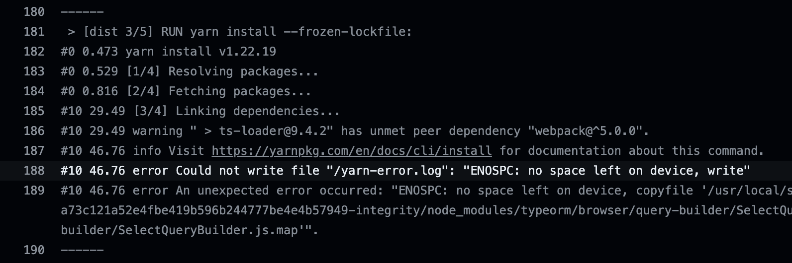
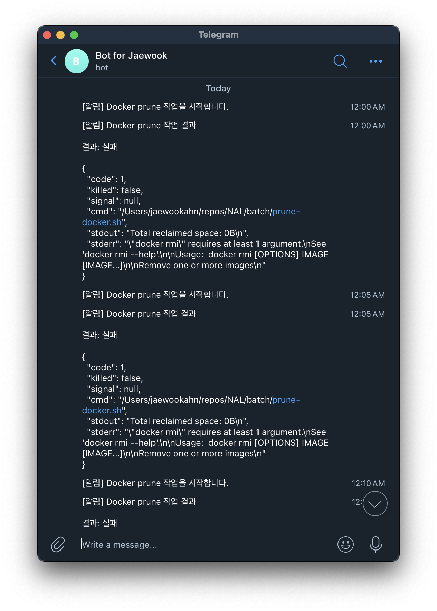

## 개발자의 관심이 고픈 서버

여느 때와 다름없이 열심히 ***먹고-자고-코딩하고-반복하고*** 를 열심히 실천하던 중, 느닷없이 한 통의 배포 실패 이메일을 받게 되었다.


<br/>
왜 곱게 배포가 안 됐는지 에러 메시지를 보니 핵심은 아래와 같았다.

> "ENOSPC: no space left on device"

뭔가 이상했다. 저 서버는 개발용으로 사용하는 맥 미니인데, 분명 디스크에 충분한 여유 공간이 있음에도 저런 에러가 발생하는 것이 이해가 되지 않았다. 일단 당장 배포가 되지 않으면 안 되는 상황이라 빠르게 구글링을 통해 원인을 검색했고, 원인을 찾긴 했다.

맥 미니는 당연히 macOS 환경이고, 나는 모든 서비스를 도커 환경 위에서 돌아가도록 구성해 놓았는데, 도커는 Linux 기반 컨테이너 가상화 플랫폼이라 macOS에서는 내부적으로 Linux VM을 이용해 Docker 엔진을 구동하게 된다. 따라서 이 VM에 미리 할당된 디스크 공간이 있고, **no space left no device** 에러는 이 VM에 더 이상 여유 공간이 없어서 발생하는 문제였다.

해결 방법 자체는 간단했다. `prune`이라는 명령어를 통해 사용하지 않는 이미지, 볼륨, 빌드 캐시 등을 정리하여 VM의 여유 공간을 확보해 주면 된다. 아래는 사용할 수 있는 `prune` 명령어이다.

```bash
# Docker 시스템상에 사용하지 않는 모든 데이터 삭제
docker system prune
# 사용하지 않는 모든 이미지 삭제
docker image prune
# 사용하지 않는 모든 볼륨 삭제
docker volume prune
# 멈춰있는 모든 컨테이너 삭제
docker container prune
# 이미지를 빌드할 때 생성된 빌드캐시 삭제
docker builder prune
```

사용하지 않는 데이터를 삭제한다고 해서 이미 사용 중인 서비스에 영향을 끼치는 건 아니어서 (빌드 캐시를 삭제하면 다음 빌드가 좀 느려지긴 하더라) 우선은 `docker system prune` 명령어를 통해 급한 불을 껐다. 하지만 이 해결책은 일시적일 뿐, 도커 빌드 작업이 많아질수록 더 자주 해당 문제가 발생했다. (대략 한 달에 1~2번 정도 발생했던 듯)

이렇게 개발하다 특정 명령어를 주기적으로 실행해 줘야 하는 경우가 생긴다. 예를 들어서 앞서 언급한 docker prune 작업이라던가, CD(Continuous Deployment)가 세팅되지 않은 프로젝트에 수정 사항이 생겨서 배포를 수동으로 해야 된다거나 서버의 보안 패치, 주기적인 로그 파일 삭제 등이 될 수 있다.

배운 게 개발이라, 이런 귀찮음도 개발적인 접근으로 처리하고 싶었다.

## docker prune 작업을 주기적으로 할 수 없을까?

아무리 못해도 한 달에 한 번 정도 docker prune 명령어를 실행해야 하는데, 가끔 까먹을 수도 있고, 더 짧은 주기로 이 작업을 해야 할 수도 있었다. 그래서 제일 먼저 떠올랐던 건 도커 자체적으로 prune 명령어를 주기적으로 실행하는 옵션이 있는지 찾아보는 것이었는데, 아쉽게도 그런 편의 기능은 없는 것 같아서 차선책으로 떠올린 것이 바로 `crontab` 사용이었다.

`crontab`은 워낙 유명한 스케줄링 툴이니까, 한 2주에 한 번씩 작업을 스케줄링하면 되겠다고 생각해서 곧바로 crontab으로 실행할 prune 스크립트를 작성했다. 그런데 테스트를 위해 서버에 적용하려고 보니, 작성한 스크립트가 잘 실행됐는지 결과를 알기 위해서는 결국 서버에 접속해서 결과를 확인해 줘야 한다는 것을 깨달았다. 만약 스케줄링이 제대로 되지 않았거나 스크립트 오류로 원하는 주기에 작업 실행이 되지 않았을 상황 자체를 방지하고 싶었다.

### 10초 만에 작성한 prune 스크립트

파일 만드는 데 한 5초쯤 걸렸을 거고, 쓰레기 파일이 제일 많이 쌓이는 게 dnagling image랑 빌드 캐시라고 생각해서, 전체 시스템에 대해 prune 작업을 실행하는 것이 아니라 딱 두 부분에 대해서만 prune 명령어를 실행하도록 스크립트를 작성했다.

```bash
#!/bin/bash
docker builder prune -f
docker image prune -f
```

뒤에 `-f` 옵션은 force인데, 정말 삭제할지 물어보는 프롬프트를 스킵하는 옵션이다. 자동으로 이 작업을 수행하도록 해야 하므로 `-f` 옵션을 통해 삭제되는 것에 동의한 셈이다.

#### 💡 오늘의 TMI: dangling image는 뭘까?

나도 이번에 찾아보면서 알게 되었는데, dangling image에 대해 명확하게 설명한 글이 있어서 답변 문장 일부를 인용하려고 한다.

> *a dangling image just means that you've created the new build of the image, but it wasn't given a new name. So the old images you have becomes the "dangling image". Those old image are the ones that are untagged and displays "\<none\>" on its name when you run docker images.*<br/>
> — stackoverflow 답변 중

이미 충분히 잘 설명되어 있긴 하지만 한국어로 요약하자면, 이미지를 같은 이름과 태그로 계속 빌드하게 되면, 이전에 생성한 같은 이름과 태그를 가진 이미지가 `<none>` 으로 표시되고, 이 이미지들이 dangling image라는 것이다.

## OK 서버, 작업 결과 자동으로 알려줘

정리하자면, 내가 달성하고자 하는 목표는 아래와 같았다.

- 2주에 한 번씩 docker prune 작업 실행
- 작업 실행 결과 알림 (성공/실패 여부와 확보된 공간과 같이 출력된 메시지)
<br/>
그래서 메시지를 전송할 수 있는 봇을 사용해야겠다고 생각했다. 후보는 세 개 정도 됐는데, Slack, Discord, Telegram 정도가 떠오르더라. 나는 그중에 **Telegram 봇을 선택해서 구현**하기로 했다. (Slack과 Discord는 다른 메시지도 오는데 Telegram은 주로 사용하는 메신저가 아니라서 확실히 봇 알림을 구분하기 좋았기 때문에)

Telegram은 봇 친화적인 서비스여서, *BotFather*라는 봇을 통해서 손쉽게 새로운 봇을 만들 수 있다. 나는 예전에 *"Bot For Jaewook"* 이라는 이름의 Node.js 기반 개인 봇을 만들어뒀기 때문에 이 봇에서 작업하기로 했다.

### crontab 대신 선택한 node-cron

봇에서 쉘 명령어를 실행해서 직접 crontab 작업을 스케줄링할 수도 있지만, 그렇게 하면 작업 결과를 봇 서비스에서 받아보기가 귀찮아져서 `node-cron` 모듈을 사용하기로 했다. node-cron도 crontab과 마찬가지로 cron expression을 이용해 코드의 실행 주기를 설정하는데, 실행할 코드에 쉘 스크립트를 실행하는 쉘 명령어를 지정해 줬다.

```ts
export const registerCronTask = (bot: TelegramBot) => {
    cron.schedule("0 9 1,15 * *", async () => {
        if (sendTarget.id === 0) {
            return;
        }

        bot.sendMessage(sendTarget.id, "[알림] NAL Docker prune task 시작");
        const result = await pruneDocker();
        bot.sendMessage(sendTarget.id, result);
    });
};
```

방금 말한 작업을 봇 서비스에서 실행할 수 있는 함수 형태로 작성했다. 매달 1일, 15일에 작업을 실행하도록 cron expression을 작성했고, 해당 작업이 스케줄링 되면 먼저 작업을 시작한다는 알림 메시지를 보내고, 실제 작업이 시작된다. 이후 `pruneDocker` 함수가 반환하는 작업 결과를 다시 한번 메시지로 보내는 식으로 구성했다.

 이제 위 코드에서 호출하는 `pruneDocker` 함수는 어떻게 작성했는지 알아보자.

```ts
export const pruneDocker = async () => {
    let result = "[알림] NAL Docker prune task 종료\n\n";

    try {
        const $HOME = await getHomePath();
        const { stdout, stderr } = await exec(path.join($HOME, "repos", "NAL", "batch", "prune-docker.sh"));

        if (!stderr) {
            result += "결과: ✅ 성공\n\n";
            result += stdout;
        } else {
            result += "결과: ⚠️ 실패\n\n";
            result += stderr;
            result += stdout;
        }
    } catch (err) {
        result += "결과: ⚠️ 실패\n\n"
        result += JSON.stringify(err, null, 2);
    } finally {
        return result;
    }
};
```

이 함수는 `result` 변수에 결과 메시지를 구성해서 작업 결과에 대해 반환하게 되는데, 작업 결과를 바로 메시지로 보낼 수 있도록 처음부터 메시지 포맷으로 결과 문자열을 구성했다. 앞서 언급한 대로, 실제 prune 작업은 쉘 스크립트를 통해서 이루어지는데, Node.js의 내장 함수 중에 `child_process` 모듈 내 `exec` 함수를 이용했다. 원래 이 함수는 결과를 Promise 형태로 리턴하지 않는데, 이를 Node.js 내장 모듈인 `util`의 `promisify`를 이용하면 Promise 형태로 리턴하도록 바꿔줄 수 있다.

`exec` 함수의 인자로 쉘 스크립트의 위치를 넣어줬는데, 환경 변수 등으로 위치를 지정해 줄 수도 있었지만, 어차피 한 서버에서 쭉 돌릴 것이라 귀찮아서 그냥 하드코딩으로 대충 마무리했다. 반환값으로 나오는 `stdout`, `stderr`에 따라서 작업 결과를 분기했는데, 만약 stderr 값이 *truthy value*라면 뭔가 문제가 생겨서 에러가 난 상황이라 실패했다고 간주했다.

> 💭 쉘 명령어를 실행하는 방법에는 *exec*, *spawn* 두 가지가 있다. 상황에 따라 적합한 방법을 사용하면 된다.

---

```ts
import { promisify } from "util";
import { exec as _exec } from "child_process";

const exec = promisify(_exec);
```

이렇게 callback 함수 사용을 피해서 async / await 패턴을 사용할 수 있다. `bluebird` 같은 써드파티 라이브러리를 사용해서 Promise로 래핑하는 것보다 내장 모듈을 사용하는 게 패키지 의존성도 줄이고 여러모로 좋다고 생각한다.

## 테스트 가보자

대충 이렇게 구현하는데 한 시간 반 정도 걸렸던 것 같다. 테스트를 위해 5분에 한 번씩 작업을 스케줄링 하고 텔레그램을 통해 메시지를 잘 받을 수 있는지 확인해 봤다.



저거 하고 뭐 좀 먹고 오니까 텔레그램에 메시지가 한가득 쌓여있었다.. 일단 다 실패라고 해서 내용을 보니 지울 이미지가 없어서 작업이 계속 실패한 것 같은데, 처음에 `docker rmi` 명령어로 이미지를 지우는 방식을 채택했는데, 이렇게 되면 지울 이미지가 없으면 오류가 발생하는 것 같길래 이것도 그냥 `docker image prune` 명령어로 바꾸기로 했다.

## [덤] 텔레그램 봇의 메시지 전송에 대하여

이 글을 보고 직접 텔레그램 봇을 구현하고자 문서를 보는 사람들이 가질만한 궁금증에 대해 말해보려고 한다.

기본적으로 텔레그램 봇은 그룹 채팅이나 채널이 아니라면 봇 스스로 먼저 메시지를 보낼 수 없다. 봇이 메시지를 보내기 위해서 ***chat id***라는 값이 필요한데, 이 값으로 어떤 대상에게 메시지를 보낼지 결정하는 것이다. 만약 `@username` 같은 값으로 봇 스스로 메시지를 보낼 수 있는 게 가능하다면, 텔레그램 사용자들은 불특정 봇들에게 스팸 메시지 테러를 당할 수도 있다. 따라서 텔레그램에서는 사용자가 봇에게 **먼저** 대화를 걸어야 그 대화에 대해서만 반응을 할 수 있는 구조로 되어 있다.

나의 경우에는, 내가 만든 봇은 어차피 나만 사용할 것이고 이 봇도 나한테만 알림 메시지를 보내면 되기 때문에, 내 계정의 *chat id*를 알아내 기본 값으로 등록했고, *chat id*를 관리하는 클래스를 작성해서, 배치 작업이 스케줄링 되었을 경우에 미리 알고 있는 *chat id*를 이용하여 나에게 알림 메시지를 보내도록 설정했다.

## 또 무슨 작업을 떠넘길 수 있을까?

우선은 주기적으로 docker prune 명령어를 실행하는 작업만 등록해 두었는데, 개발한 서비스의 health check 기능 같은 것을 더 붙이면 좋을 것 같다는 생각이 들었다. 사실 인간이 조금만 더 부지런하고 꼼꼼하면 대부분 작업을 자동화 없이 직접 할 수 있겠지만, 나는 게으른 개발자라 그런 거 모르겠다. 아무튼 이번 작업을 통해서 이런 식으로 봇을 활용하는 게 개발을 옳은 방향으로 사용하는 것 같은 성취감도 들었고, 컨텍스트 스위칭을 줄여 쓸데없는 일을 하느라 집중력을 잃지 않을 수 있다는 점도 기대해 볼 수 있겠다. 이 글을 읽는 여러분들도 봇한테 귀찮은 작업을 떠넘겨보는 것을 추천하며 글을 마치겠다.

## References

1. [GitHub NAL - prune script](https://github.com/Jaewoook/NAL/blob/main/batch/prune-docker.sh)
2. [GitHub Node.js Telegram Bot API](https://github.com/yagop/node-telegram-bot-api)
3. [GitHub Node Cron](https://github.com/node-cron/node-cron)
4. [SafeDev, "What is a dangling image and what is an unused image?", stackoverflow, Oct 13, 2023. https://stackoverflow.com/a/45143234.](stackoverflow)