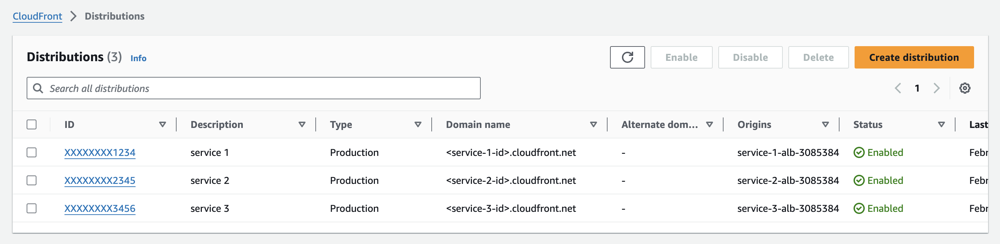
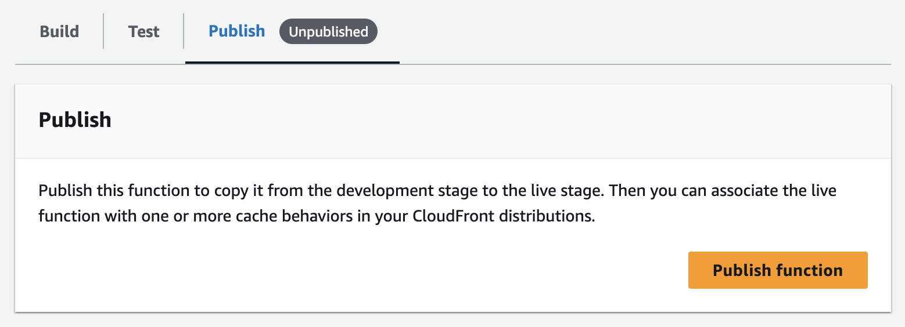

import { FigureImage } from "@/components/post";
import { Span } from "@/components/typography/Paragraph";

하나의 서비스를 만들기 위해서는 다양한 방면에서 많은 시간과 노력이 필요하다. 물론 회사에서, 혹은 팀으로 작업하게 되면 역할 분담이 되겠지만, 개인적으로 사이드 프로젝트를 진행하는 경우에는 어쩔 수 없이 혼자 여러 부분을 신경 쓸 수밖에 없다. 이러한 상황에서 계륵 같은 존재가 바로 **인증**이다. 인증은 거의 모든 서비스에 없어서는 안 되는 존재이지만 꼼꼼한 구현이 필요하다. 프로젝트마다 다른 요구사항 덕분에 인증을 구현하는 적절한 방식을 선택해서 개발해야 하므로 초반에는 인증에 대해 고민하지 않고 기능부터 개발하는 경우도 많다.

이번 글에서는 <Span className="!text-orange-500 font-medium">AWS에 배포된 서비스에 대해 최대한 간단하게 인증을 구성하는 방법</Span>에 대해 다뤄보려고 한다. 이 글에서 소개하는 인증 방법은 강력한 보안을 제공하는 인증이 아니기 때문에 프로덕션 환경에 직접 적용하기엔 무리가 있다. 하지만 폐쇄망 환경이거나 개발 단계에서 제대로 된 인증 구현 전에 임시로 사용하기에 괜찮아서 글을 쓰게 되었다.

# ✋ HTTP 인증

HTTP는 일반적인 접근 제어와 인증에 대한 방법을 제공하고 있다. 우리는 이 중 **Basic 인증**을 이용하려고 한다. 먼저 아래 *Figure 1*을 보자.

<FigureImage caption="Figure 1. Basic Authentication Popup">
  
</FigureImage>

위 팝업은 특정 사이트에 접속하려고 했으나, 권한이 없다고 사용자 계정을 물어보는 팝업이다. 브라우저에서 자체적으로 위와 같은 팝업을 띄운다는 점이 보통의 로그인 페이지와 다른데, 이는 요청한 URL에서 `401 Unauthorized` 코드와 함께 응답 헤더에 `WWW-Authenticate`가 포함되어 있으면 `WWW-Authenticate` 값에 따라 사용자에게 인증을 요구하게 된다. 만약 요구하는 인증 방식이 `Basic`이라면 브라우저는 사용자에게 *Figure 1*과 같이 계정 정보에 대해 물어보는 팝업을 띄우는 것이다.

팝업에 사용자 정보를 입력하면 `<Username>:<Password>`의 값을 Base64로 인코딩하여 요청 헤더 `Authorization` 필드의 값에 넣고, 같은 주소로 한 번 더 요청하게 된다. 만약 입력한 정보가 유효한 계정 정보라면 정상적인 응답이 올 것이고, 아니라면 처음과 같은 `401 Unauthorized` 응답이 올 것이다.

Basic 인증은 다른 인증과 달리 Username과 Password 값으로 인증을 진행하기 때문에 팝업을 통해 입력값을 받을 수 있다. 따라서 별도의 로그인 페이지를 구현하지 않아도 내장된 팝업을 통해 인증을 진행할 수 있다는 장점이 있다.

> 💭 팝업 없이 https:\/\/**\<username\>:\<password\>**@example.com 형태로 계정 정보를 입력할 수도 있다.

여기까지만 보면 어쨌든 HTTP 인증을 처리하기 위한 서버가 필요하다고 생각할 수 있다. ~결국 서버 코딩해야 하는 거 아님?~ 이는 반은 맞고, 반은 틀렸다. 보통은 Nginx 같은 WAS 혹은 자체적으로 서버에 구현하지만, 우리는 Cloudfront Function을 사용할 것이기 때문에 상대적으로 간단하게 이를 구현할 수 있다.

이를 도표로 정리하면 다음과 같다.


이 글에서 설명할 간단한 인증을 구성하는 방법은 다음과 같은 단계를 따른다.

1. Coudfront와 AWS 리소스 연결
2. 인증을 위한 function 작성
3. Cloudfront와 인증 function 연결

# 🔒 AWS 리소스 기본 DNS를 HTTPS로

웹 서비스를 AWS에 배포했다면 AWS에서는 기본적으로 배포한 서비스에 접근할 수 있는 DNS 엔드포인트를 제공한다. 하지만 이 엔드포인트는 HTTP 통신만 지원한다는 단점이 있다. HTTP 통신은 서버와 클라이언트가 주고받는 데이터에 대해 암호화하지 않기 때문에 먼저 엔드포인트에 대해 HTTPS 접근이 가능하도록 설정하는 것을 알아보자.

<FigureImage caption="Figure 2. AWS Architecture Diagram">
  
</FigureImage>

이번 글에서는 서비스가 AWS에 다이어그램과 같은 구성으로 배포되어 있다고 가정하고 설명을 진행하려고 한다. 전체적인 아키텍처는 EC2를 용량 공급자로 하는 ECS의 기본 형태이다. ECS 앞단에 Application Load Balancer(ALB)를 하나 두고 서비스로 들어오는 모든 요청을 ALB를 통해 Auto Scaling Group(ASG) 안에 있는 EC2 인스턴스에 적절히 로드밸런싱 시켜서 서비스에 대한 요청을 처리한다.

> 💭 위 아키텍처에서는 ASG에 의해 EC2 인스턴스가 늘어나거나 삭제, 혹은 교체되었을 경우 EC2 인스턴스의 IP가 바뀌게 되는데 각 인스턴스마다 EIP(고정 IP)를 할당해 주지 않고 단지 ALB에 연결해 줌으로써 인스턴스 IP 변경에 대응이 가능하다는 장점이 있다.

아키텍처 상의 모든 리소스는 퍼블릭 서브넷에 있으므로 ALB의 DNS 엔드포인트를 통해 서비스에 직접 접근할 수 있다. 하지만 여기엔 중요하게 짚고 넘어가야 할 문제가 있다. AWS의 기본 DNS 엔드포인트는 HTTPS를 지원하지 않으므로 서비스와의 통신이 암호화되지 않기 때문에 클라이언트와 조금이라도 민감한 데이터를 주고받기에는 적합하지 않다. 따라서 ALB 앞단에 Cloudfront(CF)를 두어 CF 엔드포인트로 HTTPS 통신을 하게끔 구성해 볼 것이다.

## ALB 앞단에 CF를 두는 이유

ALB는 CF 없이도 자신이 소유한 도메인을 연결해서 HTTPS 통신을 할 수 있다. 하지만 연결할 도메인이 없는 경우에는 어떻게 해야 할까? Vercel 같은 곳에 서비스를 올린다면 기본으로 HTTPS 도메인을 제공하는데 AWS는 치사하게 HTTPS 지원을 해주지 않는 걸까? 물론 아니다. 앞서 언급한 CF가 HTTPS를 제공해 준다. 정리하자면, ALB는 소유한 도메인을 등록한다면 HTTPS 통신이 가능하고, 만약 소유한 도메인이 없다면 CF의 HTTPS 지원을 이용해 HTTPS 통신을 할 수 있다! (아래 그림처럼 `<service-id>.cloudfront.net` 형태의 엔드포인트가 제공된다.)

<FigureImage caption="Figure 2.1. Cloudfront Endpoints"></FigureImage>

또한 CF는 CDN 서비스이기 때문에 이를 사용한다면 서비스의 응답이나 리소스 등을 캐싱해서 반응성을 향상시킬 수 있다. 비용적인 측면에서도 CF는 프리 티어를 제공하기 때문에 만약 아직 도메인 구입을 하지 않은 경우에 CF를 통해 공짜에 가깝게 CDN을 사용할 수 있다. 아래는 Cloudfront의 프리 티어에서 무료로 제공하는 항목과 범위이다.

> **언제나 무료인 프리 티어에 포함된 항목**
>
> - 매월 1TB의 데이터를 인터넷으로 전송
> - HTTP 또는 HTTPS 요청 1,000만 건/월
> - CloudFront 함수 간접 호출 200만 건/월
> - CloudFront KeyValueStore 읽기 200만 건/월
> - 무료 SSL 인증서
> - 제한 없음, 모든 기능 사용 가능
>
> _— Cloudfront 요금 페이지 중_

이러한 이유로 CF를 ALB 앞에 두고, ALB로 바로 접근하는 요청에 대해서는 400번 대 Status Code를 내려주어 ALB로의 직접적인 접근은 차단할 계획이다.

## CF Distribution 생성

*Figure 2.1* 우상단에 있는 _Create distribution_ 버튼을 누르면 아래와 같이 distribution을 생성하는 화면이 나온다. *Choose origin domain*을 누르면 이미 AWS에 존재하는 리소스들을 선택할 수 있는데, 우리는 여기에서 ALB를 선택할 것이다.

> 💭 Origin domain list에는 private subnet에 있는 리소스도 표시된다. 하지만 CF는 VPC 외부에 있기 때문에 private subnet에 있는 리소스와 연결할 수 없다는 점을 주의해야 한다.

<FigureImage caption="Figure 2.2. Select Origin Domain">
  
</FigureImage>

ALB를 선택하게 되면 아래와 같이 Protocol과 HTTP Port를 입력할 수 있다. 여기에서 선택하는 Protocol은 ALB로 전달되는 요청의 Protocol이기 때문에 HTTP를 선택해야 한다. Port에는 로드밸런서의 Listener Port를 입력하면 되는데, 요청을 전달할 포트가 기본 포트 80이 아니라면 원하는 값을 입력하면 된다.

<FigureImage caption="Figure 2.3. Origin Protocol & Port">
  
</FigureImage>

여기까지 했다면 Origin 섹션에서는 특별히 더 할 일이 없다. 나머지 필드는 다 기본값으로 비워두고, Cache Behavior 섹션을 살펴보자. 이제는 Viewer Protocol을 설정해 줄 건데, Redirect HTTP to HTTPS는 HTTP로 접속하더라도 자동으로 HTTPS로 리디렉션해주는 옵션이다. 이 옵션을 선택해야 HTTPS 통신을 강제할 수 있다.

Allowed HTTP methods는 상황에 따라서 선택해야 하는데, 만약 연결할 리소스가 API 서버처럼 REST API 사용을 한다면 모든 methods를 허용해 줘야 하고, 웹 페이지와 같이 엔드포인트에 대해 GET 요청만 필요한 경우에는 GET, HEAD 요청만 허용해 주면 된다. 마지막으로 Restrict viewer access는 HTTP Basic Authentication을 적용할 것이기 때문에 기본값인 No로 둘 것이다,

<FigureImage caption="Figure 2.4. Set Cache Behavior">
  
</FigureImage>

이제 Cache와 Origin 요청 정책을 설정해 줘야 한다. 대부분의 경우에 AWS에서 미리 정의한 정책을 사용하면 된다.

Origin 요청 정책은 AllViewer 같이 모든 request parameter를 전달하는 옵션을 선택하면 된다.

<FigureImage caption="Figure 2.5. Set Cache Behavior">
  
</FigureImage>

Function과 WAF 설정은 일단은 비워두도록 한다. WAF는 AWS에서 제공하는 웹 방화벽인데 이걸 사용하게 된다면 Distribution 하나에 대해 최소 월 8달러 정도의 비용이 발생하기 때문에 일단은 끄고 진행할 것이다.

<FigureImage caption="Figure 2.6. Set Function and WAF">
  
</FigureImage>

모든 설정을 마쳤으니, distribution을 생성해 준다. 이제 생성된 distribution에 대한 접속 주소볼 수 있는데, 해당 주소로 접속했을 때 서비스에 정상적으로 접근되는지 확인해 보자. distribution을 생성하고 얼마 지나지 않은 시점에는 정상적인 접속까지 약간의 시간이 필요할 수 있다.

# 🔑 Cloudfront Function으로 인증 처리

Distribution을 생성했다면 인증에 필요한 로직을 CF Function으로 작성할 차례이다. CF는 총 4단계에서 Function의 개입이 가능한데, Viewer Request 단계에서 인증 로직이 작동해야 한다. 인증 로직은 간단하다. 요청이 유효한 인증값을 가졌는지 검사하고, 이 검사를 통과하면 요청을 AWS 리소스로 그대로 전송한다. 검사를 통과하지 못했다면 `401 Unauthorized` 에러를 응답하도록 설정해 줄 것이다.

## Function 생성 및 배포

우선 다음과 같이 Function부터 만들어준다. Cloudfront 메뉴에서 Function을 누르면 아래와 같은 화면이 나오고, Create function 버튼을 통해 function을 만들 수 있다.

<FigureImage caption="Figure 3. Create CF Function">
  
</FigureImage>

<FigureImage caption="Figure 3.1. Set CF Function Details">
  
</FigureImage>

Function 이름을 정하면 추가로 더 선택할 것은 없다. 생성한 function을 확인해 보면 아래와 같이 코드를 입력하는 곳이 나온다. 이곳에 인증 로직을 작성해 줄 것이다.

<FigureImage caption="Figure 3.2. Set CF Function Details">
  
</FigureImage>

## 인증 정보 만들기

인증 로직을 작성하기에 앞서 접속을 허용할 사용자 인증 정보부터 만들어 줄 것이다. Basic 인증은 사용자 인증 정보를 미리 정해놓아야 한다는 특징이 있어서 계정 정보를 정하고 Base64로 인코딩해야 한다. 예를 들어, 사용자 이름 `testuser` 비밀번호 `test1234` 를 입력했을 경우에만 접근을 허용하고 싶다면 이를 Base64로 인코딩하면 된다. Base64 인코딩 명령어는 아래와 같다.

```shell
echo -n "testuser:test1234" | base64
```

사용자 이름 `testuser`, 비밀번호 `test1234`에 대한 Base64 인코딩 값은 아래와 같음을 확인할 수 있다. `base64` 명령어는 POSIX 운영체제(macOS, Ubuntu 등)에 포함되어 있다.

```shell
dGVzdHVzZXI6dGVzdDEyMzQ=
```

## Function 작성

이제 실질적인 코드를 작성할 것이다. 인증을 위한 function의 기본 형태는 아래와 같다. 방금 Base64로 인코딩한 문자열 앞에 `Basic`을 붙여준 것을 알 수 있다. 이는 Authorization 헤더 값이 `Basic <base64_encoded_string>` 형태로 넘어오기 때문에 문자열 비교를 위해 앞에 `Basic`을 붙여준 것이다.

```js
const BASIC_AUTH_BASE64 = "Basic dGVzdHVzZXI6dGVzdDEyMzQ="; // highlight-line

function handler(event) {
    const authorizationHeader = event.request.headers.authorization || { value: "" };

    // 인증 성공 시 요청을 그대로 Origin에 전달
    if (authorizationHeader.value === BASIC_AUTH_BASE64) { // highlight-line
        return event.request;
    }

    // 인증 실패 시 401 Unauthorized 응답
    return {
        statusCode: 401,
        statusDescription: "Unauthorized",
        headers: {
            "content-type": { value: "text/html" }, // highlight-line
            "www-authenticate": { value: "Basic realm=\"Authorization required\"" },
            // Enable HSTS
            "strict-transport-security": { value: "max-age=63072000;includeSubDomains; preload" }
        }
    };
}
```

인증 실패 시 응답에 `content-type: text/html` 을 포함했는데, 사파리에서는 `content-type` 헤더가 없으면 인증 팝업이 표시되지 않는 문제가 있었다. 이를 `content-type`을 포함해 해결했다. 다음으로 Http Strict Transport Security(HSTS) 헤더도 추가해 줬는데, 이는 클라이언트에 HTTPS 통신만을 사용하겠다고 명시하는 헤더이다. 인증 정보를 전송할 때 Base64 인코딩만 하므로 혹시라도 HTTP 통신 중 패킷이 노출된다면 인증 정보가 그대로 해커에게 노출될 수 있다는 위험이 있다. 이를 막기 위해 Cloudfront로 HTTPS 통신이 가능하게끔 구성한 것이고, CF Function에서 HSTS를 명시하여 HTTPS로 인증 정보를 암호화하여 전송하는 것이다.

위 코드를 적당히 변형하거나 본인이 작성한 인증 코드를 *Figure 3.2* 코드 에디터에 작성해 준다. 코드 작성을 완료하였다면 Test 탭을 통해 문법과 동작에 문제가 없는지 아래처럼 확인할 수 있다.

<FigureImage caption="Figure 3.3. Test CF Function">
  
</FigureImage>

`Request headers` 필드에 `Authorization` 헤더를 추가하고, 값을 지정해 주면 간단한 동작 테스트가 가능하다. 테스트를 완료하였다면 Publish 탭에서 live stage로 작성한 함수를 배포하면 끝이다.



## CF Function 연결

이렇게 작성한 CF Function과 Distribution을 연결해 줄 차례이다. Cloudfront distribution을 눌러서 Behaviors 탭으로 이동해서 기본적으로 정의되어 있는 behavior을 수정해 주면 된다.

<FigureImage caption="Figure 3.4. Link CF Function">
  
</FigureImage>
 
<FigureImage caption="Figure 3.5. Set CF Function on Behavior">
  
</FigureImage>

위에 언급했듯이 Function associations 섹션에서 Viewer request 부분에 CF Function을 선택하고 저장하면 된다.

여기까지 모든 설정을 완료했다면 Cloudfront를 통해 접속하는 사용자에게 *Figure 1*처럼 계정 정보를 요청하는 것을 확인할 수 있다.

# ⛔️ ALB 접근 막기

마지막으로 해야 할 중요한 할 일이 하나 남았다. 바로 Cloudfront 뒤에 있는 AWS 리소스로의 직접적인 접근을 막는 작업이다. 안 그러면 여태껏 힘들게 인증을 붙여놓은 것을 무시하고 바로 서비스 접근이 가능하기 때문이다.

<FigureImage caption="Figure 4.1. Block Direct Access">
  
</FigureImage>

이 작업을 위해 리소스와 연결되어 있는 ALB의 HTTP Listener 페이지에 접속해야 한다. Default rule을 선택하고 Edit rule을 눌러 수정하는 화면으로 접속한다. 아래와 같이 무조건 HTTP 401을 응답하도록 설정하고 저장한다.

<FigureImage caption="Figure 4.2. Block Direct Access">
  
</FigureImage>

다음으로는 새로운 Rule을 추가해 줄 것이다. 이 규칙은 Cloudfront에서 전달받은 요청에 인증 헤더가 있을 때만 서비스에 접속할 수 있게 한다.

<FigureImage caption="Figure 4.3. Block Direct Access">
  
</FigureImage>

<FigureImage caption="Figure 4.4. Block Direct Access">
  
</FigureImage>

아까 CF Function에서 Authorization 헤더 값을 확인하는 것과 똑같이 설정해 주면 된다. 이후 리소스의 Target Group에 해당 규칙을 연결해 주면 인증에 필요한 모든 설정을 완료할 수 있다.

<FigureImage caption="Figure 4.5. Block Direct Access">
  
</FigureImage>

# ⌛️ 정리

서비스에 요청을 보내게 되면 아래와 같은 흐름으로 요청을 처리하게 됨을 알 수 있다. Cloudfront Function과 ALB HTTP Listener 모두 인증을 거치므로 인증 헤더 없이는 서비스에 접근할 수 없게 되는 것이다.


지금까지 AWS에서 HTTP 인증을 활용해 서비스에 대한 인증을 구성하는 방법에 대해 알아보았다. 간단하게 인증을 구성하는 방법이라고 했지만 설정 과정이 그렇게 단순하지는 않다. 그래도 로그인 페이지 구현의 생략, 인증 세션 혹은 토큰 발급 과정 등을 생략할 수 있으므로 상대적으로 빠르게 인증 구색을 갖출 수 있다는 장점이 있다고 생각한다. 이 글에서는 AWS 플랫폼에서 제공하는 기본적인 기능을 활용하는 방향으로 설명을 진행하였는데, 어느 환경이든 이와 비슷하게 구성이 가능하다. 이 글이 조금이라도 도움이 되었길 바라며 글을 마치겠다.

# 📚 References

1. [Cloudfront 요금 페이지](https://aws.amazon.com/ko/cloudfront/pricing/)
2. [HSTS MDN 문서](https://developer.mozilla.org/en-US/docs/Web/HTTP/Headers/Strict-Transport-Security)