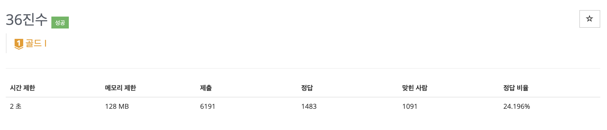
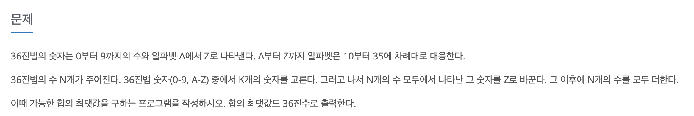

import { Span } from "@/components/typography/Paragraph";

export const listEmphasisStyle = "!text-orange-500 !leading-6 !font-medium !text-base";
export const listPlusStyle = "!text-teal-500 !leading-6 !font-medium !text-base";
export const paragraphSpanStyle = "!text-teal-500 !font-medium";

코딩 테스트를 준비하면서 그리디 알고리즘에 꾸준히 약한 것 같다는 생각이 들어서 최근 그리디 알고리즘 문제를 찾아 풀고 있다.
이번 글에서는 36진수 문제를 풀며 했던 실수들과 주의해야될 부분을 중점적으로 살펴보며 문제에 대한 풀이를 해보려고 한다.

# 📚 문제




문제 지문에서 원하는 바를 이해하는 것은 어렵지 않을 것이다. 제한시간이 2초인 것으로 보아 뭔가 시간이 많이 드는 연산이 필요하거나 루프를 여러 번 돌아야 할 수 있음을 짐작할 수 있다.

풀이는 <Span className="text-blue-500">Python3</Span>을 기준으로 진행할 것이다. 문제에서 입력받을 수 있는 숫자의 길이가 50까지 가능하기 때문에 큰 수 연산이 필요하다. 따라서 파이썬, JS와 같이 큰 수 연산을 기본적으로 지원하는 언어로 문제를 푸는게 코딩테스트에서 유리할 것 같다. 만약 다른 언어를 이용해서 문제를 풀고자 한다면 데이터 자료형의 범위를 신경써서 풀자.

# 🏆 해결방법 접근

다음은 문제 해결을 위해 생각했던 접근 방법들과 해당 방법에 대해 세웠던 조건에 대한 내용이다.

## 🙅 잘못된 접근 - 큰 자릿수의 숫자부터 고르는 방법

문제에 <Span className={paragraphSpanStyle}>"N은 최대 50"</Span>이라는 입력 조건이 있어서, 먼저 36 x 50 크기의 배열을 선언하고, `N`개의 수에 대해 각 자릿수마다 숫자가 몇 번 등장하였는지 기록하고자 했다. 이렇게 하면 특정 숫자를 골라서 `Z`로 바꾼 다음, 배열에 기록한 숫자를 10진수로 변환 후 다시 36진수로 변환하면 쉽게 `N`개 수의 합을 얻을 수 있을 것 같았다. 예를 들어, `N = 3`이고, 숫자 `123ABB`, `456DEF`, `234ABC`가 입력되었다고 하면, 배열에는 다음과 같이 기록하는 것이다. (배열은 `numbers`로 선언했다.)

- 1번째 자릿수: 1 -> 1번, 2 -> 1번, 4 -> 1번
- 2번째 자릿수: 2 -> 1번, 3 -> 1번, 5 -> 1번
- 3번째 자릿수: 3 -> 1번, 4 -> 1번, 6 -> 1번
- 4번째 자릿수: A -> 2번, D -> 1번
- 5번째 자릿수: B -> 2번, E -> 1번
- 6번째 자릿수: B -> 1번, C -> 1번, F -> 1번

<br />
이후, 다음 방법에 따라 큰 자릿수의 숫자부터 `K`개의 숫자를 선택해서 `Z`로 바꿔줬다.

- **50번째 자릿수**부터 **1번째 자릿수**까지 1씩 감소하는 변수 `place`로 `numbers` 배열 순회
  - **0부터 Z**까지 1씩 증가하는 변수 `digit`으로 `numbers[place]` 배열 순회
    - 만약 `numbers[place][digit]`의 값이 0보다 크고 `K`가 0보다 큰 경우
    - `K` 1 감소
    - **0부터 49**까지 1씩 증가하는 변수 `i`로 `numbers[i][digit]`에 다음과 같이 연산
      - `numbers[i][digit]`값을 `numbers[i][35]`에 더해줌
      - `numbers[i][digit]`에 0 할당

위 방법을 코드로 작성하면 다음과 같다.

```python
for place in range(50, -1, -1):
    for digit in range(36):
        if numbers[place][digit] == 0 or K == 0:
            continue

        K -= 1
        for i in range(50):
            if numbers[i][digit] == 0:
                continue
            numbers[i][-1] += numbers[i][digit]
            numbers[i][digit] = 0
```

<br />
`K`개의 숫자를 선택해 모두 `Z`로 바꿔줬다면 다음의 연산을 통해 숫자의 합을 계산할 수 있다.

- `numbers` 배열에 기록된 각 자릿수별로 등장한 숫자의 횟수를 10진수로 변환
- 계산한 10진수 값을 36진수로 변환

```python
"""
10진수 숫자를 36진수 숫자로 변환
"""
def toAlphaDigit(d: int):
    if d < 10:
        return chr(ord('0') + d)
    return chr(ord('A') + d - 10)

"""
10진수 수를 36진수 수로 변환
"""
def toAlphaNumber(n: int):
    value = ''
    while n > 0:
        digit = n % 36
        n //= 36
        value = toAlphaDigit(digit) + value

    return value

total = 0
for place in range(50):
    for digit in range(36):
        total += (36 ** place) * digit * numbers[place][digit]

total = toAlphaNumber(total)
```

<br />
큰 자릿수부터 `Z`로 바꾸는 접근이 나름대로 그리디하다고 생각했다. 하지만 무조건 큰 자릿수를 우선으로 Z로 바꾼다고 N개의 숫자 총합이 최대값이 아닐 수 있다. <Span className={paragraphSpanStyle}>낮은 자릿수에서 많이 등장하는 특정 숫자를 바꾸는 것이 수의 총합에서는 더 큰 수를 만들 수도 있기 때문</Span>이다.

## 🙆 올바른 접근 - 숫자를 고르는 모든 경우 계산

큰 자릿수의 숫자부터 고르는 것이 아니라, 숫자를 고르는 모든 경우에 대해 <Span className={paragraphSpanStyle}>각 숫자마다 Z로 바꿨을 경우 합의 증가량을 계산하는 방법</Span>으로 문제를 접근해보려고 한다. `0`부터 `Y`까지의 숫자를 `Z`로 바꿨을 경우에 합의 증가량이 제일 컸던 `K`개의 숫자를 선택하면 문제에서 원하는 합의 최댓값을 구할 수 있을 것이다. 이를 계산하는 로직은 다음과 같다.

### 숫자를 Z로 바꿨을 경우 합의 증가량 계산 로직

- 36진수 각 숫자를 `Z`로 바꿨을 때 합의 증가량을 저장하는 **길이 36**의 배열 `diff` 선언
- 다음 연산을 `N`번 반복
  - 36진수 숫자를 문자열로 입력받아 `value`에 할당
  - **0**부터 **입력받은 숫자의 길이 - 1**까지 1씩 증가하는 변수 `i`로 `value`의 각 문자 순회
    - `value[i]`의 10진수 값을 구해서 `order`에 할당
    - `digit[i]`의 자릿수를 구함
    - 10진수 기준, <Span className={listEmphasisStyle}>해당 자릿수의 Z값</Span>에서 <Span className={listEmphasisStyle}>해당 자릿수의 digit[i]</Span>값을 뺀 차를 `diff[order]`에 더함

위 연산을 실행하면 `diff[숫자]`로부터 `숫자`를 `Z`로 바꿨을 경우 `N`개의 숫자 증가량의 합을 알 수 있다.

이렇게 계산한 `diff` 배열을 내림차순 정렬하고 `K`개의 `diff` 원소를 입력받았던 `N`개의 36진수 수에 더해주면 된다. 이 연산을 포함한 전체 로직은 다음과 같다.

- 36진수 각 숫자를 `Z`로 바꿨을 때 합의 증가량을 저장하는 **길이 36**의 배열 `diff` 선언
- <Span className={listPlusStyle}>숫자의 합을 10진수로 저장하는 `integer` 변수 선언</Span>
- 다음 연산을 `N`번 반복
  - 36진수 숫자를 문자열로 입력받아 `value`에 할당
  - <Span className={listPlusStyle}>`value`를 10진수로 변환하여 `integer`에 더함</Span>
  - **0**부터 **입력받은 숫자의 길이 - 1**까지 1씩 증가하는 변수 `i`로 `value`의 각 문자 순회
    - `value[i]`의 10진수 값을 구해서 `order`에 할당
    - `digit[i]`의 자릿수를 구함
    - 10진수 기준, <Span className={listEmphasisStyle}>해당 자릿수의 Z값</Span>에서 <Span className={listEmphasisStyle}>해당 자릿수의 digit[i]</Span>값을 뺀 차를 `diff[order]`에 더함
- `diff` 배열을 내림차순 정렬
- <Span className={listPlusStyle}>0부터 `K - 1`까지 1씩 증가하는 변수 `i`로 `diff`배열 순회</Span>
  - <Span className={listPlusStyle}>`integer`에 `diff[i]` 값을 더함</Span>

이를 코드로 작성하면 다음과 같다.

```python
diff = [0] * 36

integer = 0

for _ in range(N):
    value = input()
    integer += int(value, 36)
    valueLength = len(value)
    for i in range(valueLength):
        digit = value[i]
        place = valueLength - 1 - i
        order = int(digit, 36)
        diff[order] += (36 ** place) * (35 - order)

diff.sort(reverse=True)

for i in range(K):
    integer += diff[i]
```

> 💡 Python `int()` 함수의 두 번째 파라미터인 base를 36으로 지정해주면 자동으로 36진수 변환을 해준다.

### 예외 처리 - 숫자의 제일 큰 자릿수가 0인 경우

입력되는 36진수 숫자의 제일 큰 자릿수가 0으로 시작할 수 있다. 예를 들어, `0123`같은 숫자가 입력될 수 있다는 것이다. 숫자 `0123`에 대해 위에 정의한 로직을 실행하게 되면 `Z123`과 같이 의미 없는 `0`마저도 `Z`로 바뀔 수 있다. 이를 방지하기 위해 기존 로직을 보완해야 한다.

- 36진수 각 숫자를 `Z`로 바꿨을 때 합의 증가량을 저장하는 **길이 36**의 배열 `diff` 선언
- 숫자의 합을 10진수로 저장하는 `integer` 변수 선언
- 다음 연산을 `N`번 반복
  - 36진수 숫자를 문자열로 입력받아 `value`에 할당
  - 변수 `valuable` 을 `False`로 초기화
  - `value`를 10진수로 변환하여 `integer`에 더함
  - **0**부터 **입력받은 숫자의 길이 - 1**까지 1씩 증가하는 변수 `i`로 `value`의 각 문자 순회
    - <Span className={listPlusStyle}>`value[i]`의 값이 0이 아니거나, `valuable`이 `True`인 경우</Span>
      - `value[i]`의 10진수 값을 구해서 `order`에 할당
      - <Span className={listPlusStyle}>`valuable` 변수 `True` 지정</Span>
      - `digit[i]`의 자릿수를 구함
      - 10진수 기준, 해당 자릿수의 Z값에서 해당 자릿수의 `digit[i]`값을 뺀 차를 `diff[order]`에 더함
- `diff` 배열을 내림차순 정렬
- 0부터 `K - 1`까지 1씩 증가하는 변수 `i`로 `diff`배열 순회
  - `integer`에 `diff[i]` 값을 더함

위와 같이 `valuable` 이라는 논리형 변수를 이용해 실질적인 값이 없을 때 `Z`로 바꿨을 때 값의 증가량을 생략하는 방식으로 예외 처리를 할 수 있다. 이를 코드로 작성하면 다음과 같다.

```python
diff = [0] * 36

integer = 0

for _ in range(N):
    valuable = False # highlight-line
    value = input()
    integer += int(value, 36)
    valueLength = len(value)
    for i in range(valueLength):
        digit = value[i]
        if not valuable and digit == '0': # highlight-line
            continue # highlight-line
        valuable = True # highlight-line
        place = valueLength - 1 - i
        order = int(digit, 36)
        diff[order] += (36 ** place) * (35 - order)

diff.sort(reverse=True)
K = int(input())

for i in range(K):
    integer += diff[i]
```

### 예외 처리 - 10진수 0을 36진수로 변환하는 경우

10진수 수를 36진수로 어떻게 변환할 수 있을까? 나는 나머지 연산을 통해서 변환을 진행했다. 36진수 변환 로직은 다음과 같다.

- 변환하려는 10진수 수가 0보다 클 동안 다음 연산 반복
  - 10진수 수를 36으로 나눈 나머지 값을 구함
  - 구한 나머지 값을 36진수 숫자로 변환
  - 변환한 36진수 숫자를 결과 문자열 왼쪽에 붙여줌
- 결과 문자열 반환

<br />
하지만 변환하려는 숫자가 `0`이라면 위 로직의 결과가 어떻게 될까? 위 로직으로 `0`에 대해 36진수 변환을 진행하면 결과는 `''`, 즉 빈 문자열이 나온다. 따라서 숫자 `0`을 36진수로 변환하는 경우에는 별도의 예외 처리가 필요하다. 예외 처리를 포함한 36진수 변환 로직은 다음과 같다.

- 변환하려는 10진수 수가 0보다 클 동안 다음 연산 반복
  - 10진수 수를 36으로 나눈 나머지 값을 구함
  - 구한 나머지 값을 36진수 숫자로 변환
  - 변환한 36진수 숫자를 결과 문자열 왼쪽에 붙여줌
- <Span className={listPlusStyle}>결과 문자열의 길이 확인</Span>
  - <Span className={listPlusStyle}>문자열의 길이가 0인 경우 `'0'` 반환</Span>
  - <Span className={listPlusStyle}>문자열의 길이가 0보다 큰 경우 결과 문자열 그대로 반환</Span>

결과 문자열의 길이를 확인해 빈 문자열이라면 `'0'`을 반환해주면 된다. 이를 코드로 작성하면 다음과 같다.

```python
"""
10진수 수를 36진수 수로 변환
"""
def toAlphaNumber(n: int):
    value = ''
    while n > 0:
        digit = n % 36
        n //= 36
        value = toAlphaDigit(digit) + value

    return value if len(value) > 0 else '0' # highlight-line
```

# 🔑 정답 코드

위 모든 조건과 예외 처리 등을 포함하여 제출하니 정답을 받을 수 있었다. 문제의 입력, 출력 등을 포함한 전체 코드는 다음과 같다.

```python
import sys

def toAlphaDigit(d: int):
    if d < 10:
        return chr(ord('0') + d)
    return chr(ord('A') + d - 10)

def toAlphaNumber(n: int):
    value = ''
    while n > 0:
        digit = n % 36
        n //= 36
        value = toAlphaDigit(digit) + value

    return value if len(value) > 0 else '0'

input = lambda: sys.stdin.readline().rstrip()
print = sys.stdout.write

N = int(input())
diff = [0] * 36

integer = 0

for _ in range(N):
    valuable = False
    value = input()
    integer += int(value, 36)
    valueLength = len(value)
    for i in range(valueLength):
        digit = value[i]
        if not valuable and digit == '0':
            continue
        valuable = True
        place = valueLength - 1 - i
        order = int(digit, 36)
        diff[order] += (36 ** place) * (35 - order)

diff.sort(reverse=True)
K = int(input())

for i in range(K):
    integer += diff[i]

print(f"{toAlphaNumber(integer)}\n")
```