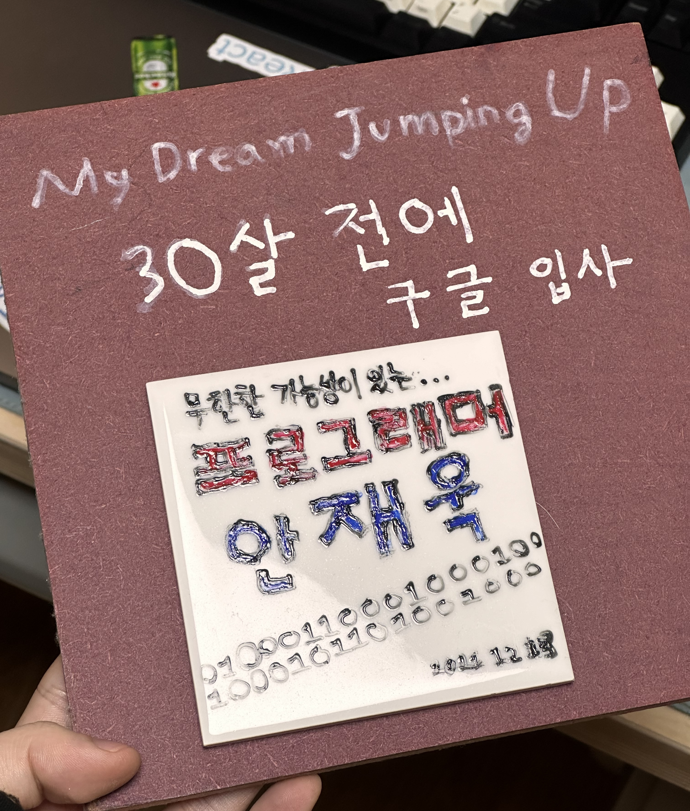
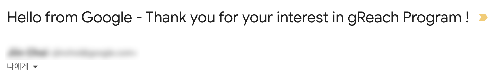
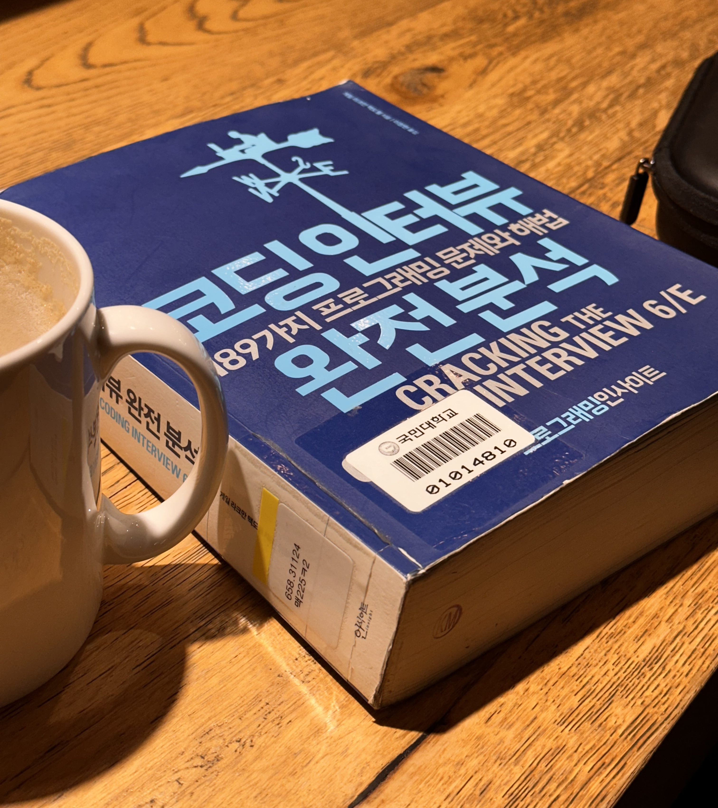
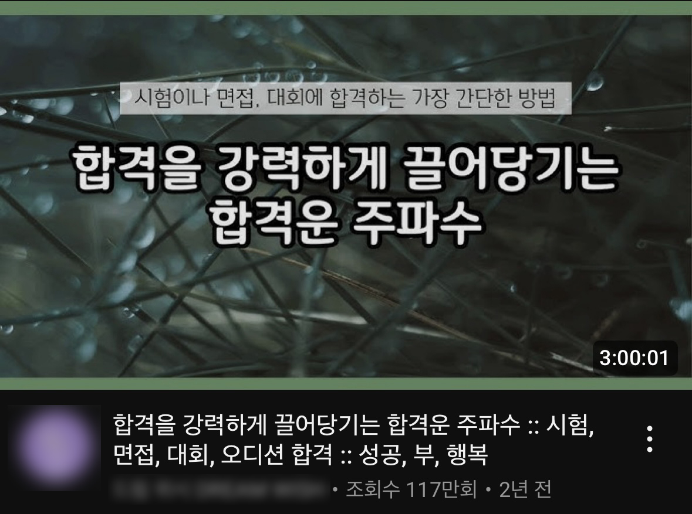
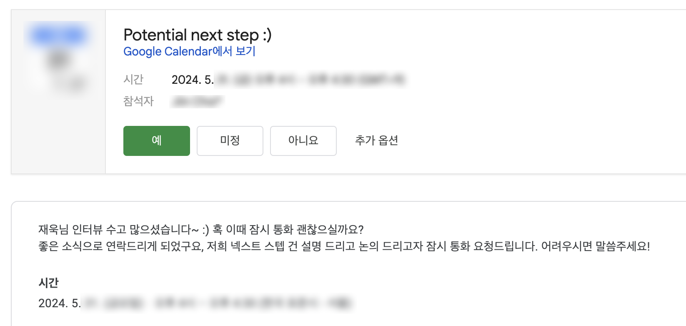

import { Span } from "@/components/typography/Paragraph";

export const Emphasis = ({ children }) => {children};
export const Highlight = ({ children }) => {children}

# 글을 시작하며

내가 중학생일 2011년 무렵, 학교에서 꿈을 주제로 만들기 수업을 했는데 이때 <i>"30살 전에 구글 입사"</i>를 적어놓은 것을 보면, 이미 저 때부터 구글 입사에 대한 꿈을 키웠던 것 같다. 저 당시는 프로그래밍을 시작한 지 얼마 되지 않았던 때였고, 구글이라는 회사는 천재 프로그래머들만 가는 회사라는 이미지가 있어서 더더욱 막연하고 대단하게 느껴졌다. 그로부터 10여 년이 지난 지금, 이렇게 구글 인터뷰 후기를 쓰게 되어 감회가 새롭다.

2022년, 구글 코리아에서 대학생을 대상으로 gReach, STEP 프로그램으로 인턴십을 진행한다는 사실을 알게 되었다. 하지만 나는 취업 준비에 안일했고, 영문 이력서 작성에 대한 막연한 두려움 탓에 4학년 2학기를 마치고 나서야 냉혹한 취업 현실을 깨달을 수 있었다. 이후 부랴부랴 레쥬메를 준비하여 2023년 12월 말에 구글 코리아 인턴십 프로그램에 지원하게 되었다.

# 지원 후 연락이 오기까지

<Highlight><i>"방학 때 진행하는 인턴십이면 방학 전에 지원하면 되지 않을까?</i>"</Highlight>는 나의 안일한 생각이었다. 만약 구글 인턴십에 관심 있다면 최대한 빨리 준비해서 지원하는 것을 추천한다. 후술하겠지만, 구글의 채용 프로세스는 꽤 오랜 시간이 걸릴 수 있다.

## 지원을 위한 준비

현재 열려있는 포지션 확인과 지원은 [Google Careers 웹 사이트](https://www.google.com/about/careers/applications/jobs/results/)에서 가능하다. 각 포지션의 업무와 필요 스킬 등 자세한 정보는 Job Description을 통해서 확인할 수 있는데, SWE 관련 포지션으로 지원하기 위해서는 컴퓨터 관련 전공(혹은 그에 상응하는 자격)이 필수적인 것으로 보인다.

구글에 입사하게 된다면 전세계 수 많은 사람들이 사용하는 제품을 만드는 경험을 할 수 있을 것이라는 생각에 가슴이 뛰었다. 그래서 포지션 확인 후 곧바로 지원 준비를 시작했다.

### Resume

구글을 포함하여 외국계 기업에서는 대체로 영문 Resume를 제출해야 하기 때문에 그동안의 경험을 담은 레쥬메를 준비했다. 디자인이나 형식은 다른 개발자들의 레쥬메를 검색하여 참고했고, 워드를 이용해 최대한 모든 내용이 한 장 안에 담길 수 있게 내용을 작성했다. 경력이 아주 많거나 특별한 경우가 아니면 One Paper Resume를 권장하는 것 같다. 하루에 수 많은 서류를 검토해야 하는 채용 담당자가 나의 이력서를 보는 데 많은 시간을 할애할 수 없기 때문에 최대한 한 장 안에 임팩트 있는 내용을 담아내는 것이 중요하다고 들었던 것 같다.

지원하는 포지션에 따라 프로젝트나 경험 등을 강조하여 작성하면 좋다고는 하는데, 나는 아직 그 정도로 다양한 경험이 없기도 하고, 구글 이외에 다른 기업에도 레쥬메를 낼 수 있다는 점도 고려해서 **그동안의 경험을 최대한 간결하게 담아내는 데에 집중**했던 것 같다. 학교에서 해외 취업을 다루는 수업을 들었는데, 해당 수업에서 레쥬메와 커버레터 작성법을 배우고, 첨삭도 받을 수 있었다. 학교에 다니는 사람들은 본인의 학교에서 해외 취업 관련 수업이 있는지 찾아보고, 들어보면 도움이 될 수도 있다고 생각한다.

지원 이후에 미국에서 학교 다니는 지인이 말해줘서 알게 된 사실인데, ATS Score라는 게 있고, ATS Checker 툴로 레쥬메를 체크할 수 있다. ATS Score는 해당 포지션의 Job Description과 레쥬메가 얼마나 일치하는 부분이 있는지 점수화한 것이라고 한다. 이런 부분도 신경 쓸 수 있다는 점이 흥미로워서 내 레쥬메도 무료 ATS Checker를 돌려봤는데 높은 점수를 얻지는 못했다.

### Cover Letter

커버레터에는 짧은 자기소개와 함께 레쥬메에 작성한 내용 중에 몇 가지를 추려서 작성했다.

구글에 지원할 때 커버레터는 optional하다. 나는 앞서 서술했듯이 해외 취업을 다루는 수업을 들으며 과제로 커버레터를 작성해야 했는데, 그 때 구글에 제출할 커버레터를 작성했고, 이를 지원 시에 활용할 수 있었다. 개인적으로 시간적 여유가 있다면 해볼 수 있는 부분은 해서 나쁠 건 없다고 생각하여 커버레터를 작성하는 것을 추천한다.

그리고 커버레터나 레쥬메를 주변 지인들에게 보여주며 피드백 받는 것을 추천한다. 나 역시 지인들이 레쥬메를 검토해 주며 오타도 발견할 수 있겄고, 내용에 대한 피드백도 받을 수 있었다.

> 📅 2023년 12월 22일 1차 지원서 접수  
> 📅 2024년 2월 28일 2차 지원서 접수

지원 후 계속 기다렸지만, 2월 말까지 아무 연락을 받을 수 없었다. 사실 STEP 인턴을 먼저 지원했는데 이게 겨울방학에 진행하는 인턴십이어서 이미 방학인 시점에는 지원서가 더 이상 고려되지 않을 것 같다고 생각했다. 따라서 구글 커리어 웹에서 다른 공고를 찾아보다가 2024 Summer Student Associate, Ad Sales 분야의 gReach 프로그램을 찾을 수 있었고 해당 포지션에 새로 지원했다.

# 사전 인터뷰

> 📅 4월 1일 사전 인터뷰 진행

그로부터 약 한달 후, 리크루터로부터 한 통의 이메일을 받을 수 있었다. 이메일을 통해서 기본적인 채용 절차 정보를 안내받고, 리크루터가 가능한 시간 중에 내가 가능한 시간을 선택하여 구글 Meet으로 30분 정도의 사전 인터뷰를 진행했다.

사전 인터뷰는 공식적인 인터뷰가 아니라고 전달받았기 때문에 가벼운 분위기로 진행됐다. 레쥬메 베이스로 이야기를 나눴고, 다른 채용 관련 글에서 봤던 것과 다르게 공식 인터뷰 이후 팀 매칭을 진행하는 것이 아니라 먼저 자리가 비는 팀에 대해 안내를 받고, 해당 팀에 지원할지 결정하는 순서로 팀 매칭을 진행했다. 물론 내가 해당 팀에 지원하고 싶다고 무조건 인터뷰가 accept 되는 것은 아니고, 해당 팀에서도 나를 검토하고 OK 해야 이후 인터뷰가 진행된다고 안내받았다.

만약 내가 지원한 팀에서 OK 사인이 떨어지지 않는다고 해서 너무 걱정하지 않아도 되고, 다른 팀에서 빈자리가 생기면 그쪽으로 연결해 주겠다는 리크루터의 이야기를 끝으로 사전 인터뷰를 마칠 수 있었다.

Ad Sales 포지션으로 지원해서 해당 포지션으로 사전 인터뷰를 진행하게 되었지만, 내가 컴퓨터를 전공했기 때문에 리크루터가 개발 관련으로 열려있는 포지션을 알아봐 준다고 했고, 다행히 포지션이 하나 있어서 SWE 쪽으로 포지션이 유연하게 전환될 수 있었다. 이 글을 빌어 포지션 전환에 신경써준 리크루터에게 감사함을 전한다.

인터뷰 중, 먼저 지원한 STEP 인턴십에 대해서 질문하니 지원한 지 90일 이상이 되면 지원 내역이 active하게 보이지 않는 모양이었다. 결과적으로 한 번 더 지원해서 리크루터에게 연락을 받을 수 있었던 것인데, 지원 후 한참이 지났는데 아무런 연락을 못 받았다면 다시 한번 지원해 보는 것도 방법일 수 있겠다.

# 기다림의 시간

사전 인터뷰 이후, 2주 정도 뒤에 리크루터로부터 한 통의 이메일을 받을 수 있었다. 지원한 팀에서 레쥬메 리뷰 중이고, 4월이나 5월 중에 인터뷰 일정이 잡힐 것 같다는 내용이었다. 인터뷰를 기다리는 동안 인터뷰 준비에 도움이 되는 자료를 공유받았다.

인터뷰를 준비하는 동안 뭘 했냐면, 그냥 평소처럼 지냈다. 카페 가서 알고리즘 문제 풀고, 재밌어 보이는 개발을 하고, 가끔 저녁에 게임이나 친구 만나서 시간 갖는 뭐 그런 흔한 취준생의 삶이었던 것 같다. 구글 인터뷰라고 다른 인터뷰랑 크게 다를 건 없다고 생각했고, 꾸준히 해오던 패턴을 유지하는 게 중요하다고 생각했다.

마지막 이메일을 받은 지 약 2주 뒤, 또 한 통의 이메일을 받을 수 있었다. 인터뷰 일정이 픽스되었다는 내용이었다! 🎉 드디어 인터뷰 일정이 잡혔다는 기쁨과 동시에 슬슬 인터뷰가 얼마 남지 않아서 긴장되기 시작했다.

5월은 가정의 달이라고, 참 여러 일정이 많았던 것 같다. 여러 약속과 일정 때문에 취준을 위한 시간을 내기가 힘들었는데, 시간 날 때마다 책을 읽으며 인터뷰를 준비했다. 참고한 책은 <b>[코딩 인터뷰 완전 분석]</b>이다. 다른 블로그 글을 찾아보다가 추천 받아서 읽게 되었는데, 급한 대로 도서관에서 빌려 봤지만 충분히 구매해서 두고두고 읽을 만한 책인 것 같다고 생각한다.

# 마침내, 인터뷰

> 📅 5월 24일 인터뷰 진행

최초 인터뷰 날짜는 5월 17일이었는데, 살짝 밀려서 24일 인터뷰를 진행했다. 인터뷰가 가까워져서 그런지, 내가 취준생인 걸 유튜브 알고리즘도 알아챈 것 같다. 인터뷰가 밀린 게 일주일 더 준비할 수 있는 시간이 생겼다고 생각해서 큰 행운이라고 생각했다.

인터뷰에서 확인하는 것들은 아래와 같다. 다른 후기에서 봤던 과정과는 다르게 나는 2개의 인터뷰를 하루에 모두 봤다. 일반적으로는 최소 3번 이상 보는 것 같은데 아무래도 나는 인턴십이라서 인터뷰를 적게 보는 것 같았다.

> 인터뷰에서 확인하는 것들
> 
> - RRK (Role Related Knowledge) - 업무 관련 지식
> - GCA (General Cognitive Ability) - 일반적인 문제 해결 능력
> - Leadership - 리더십
> - Googleyness - 얼마나 구글의 인재상과 부합하는지

인터뷰는 오전 10시에 시작해서 한 세션당 45분씩 진행했고, 중간에 45분 휴식을 가졌다. 인터뷰 문제와 질문을 공개할 순 없지만, 대략적인 과정을 남겨보려고 한다.

일단 두 인터뷰 세션 모두 인터뷰어가 최대한 편안한 분위기를 만들어 주었다. 인터뷰는 일대일로 진행되었고, 인터뷰어의 소개를 시작으로 인터뷰가 시작되었다. 첫 번째 인터뷰에서는 자료구조에 대한 문제가 나왔고, 두 번째 인터뷰에서는 배열과 인덱스 관련 문제가 나왔다. 편안한 분위기를 만들어 주려는 인터뷰어의 노력에도 불구하고 내가 엄청나게 긴장을 한 탓에, 인터뷰마다 중간에 머리가 하얘지는 경험을 할 수 있었는데 문제를 푸는데 힘들어하는 것 같으면 인터뷰어가 힌트와 생각의 방향성을 제시해 주었다.

다행히 (거의 떠 먹여주는 수준으로) 힌트를 받아서 문제 자체는 모두 풀어낼 수 있었고, 코딩 문제를 해결하고 나서 몇 가지 질문이 이어졌다. 질문에 대해 답변하고, 궁금한 점에 대해 질문 후 인터뷰를 마쳤다.

# 인터뷰 이후

이미 여기까지 진행한 시점에서, 생에 다시 없을 소중한 경험을 했다는 생각에 인터뷰 기회를 가졌다는 것 자체에 감사하기로 했다. 또, 인터뷰를 보기까지 수많은 경험을 할 수 있게 도와주셨던 분들, 조언해 줬던 지인들에게 감사함을 느꼈다. 사실 2024년 상반기에 수많은 국내 기업 공채에 지원했었지만, 한 군데도 인터뷰까지 가지 못하다가 유일하게 인터뷰를 본 기업이 구글 코리아였다. 자존감이 많이 떨어질 수 있었던 상황에서 인터뷰 기회를, 그것도 구글에서 주어졌다는 것 자체가 막막한 취준 과정에서 한 줄기 희망이었다.

인터뷰 진행 후 다음 주에 <Highlight>리크루터로부터 한 통의 이메일을 받을 수 있었다. 좋은 소식으로 연락드린다는 내용이었다!</Highlight> 아직 이 글을 쓰는 시점에서 그 좋은 소식이 최종 합격인지, 추가 면접을 요청하는 내용인지는 모르겠지만 설령 그게 어떤 것이라도 이미 만족하고, 안 좋은 결과가 있더라도 경험 자체를 소중한 추억으로 간직하기로 했다. 만약 합격한다면 생각지도 못한 큰 선물을 받았다고 생각하기로 했다.

---

이후 미팅을 통해 여러 가지 정보를 들을 수 있었다. <Highlight>두 번의 인터뷰 모두 좋은 평가를 받았고, 내부 프로세스를 거친 후 오퍼가 있을 거라는 내용이었다!</Highlight>