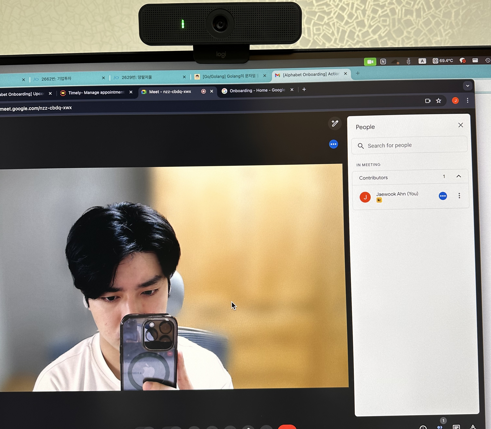
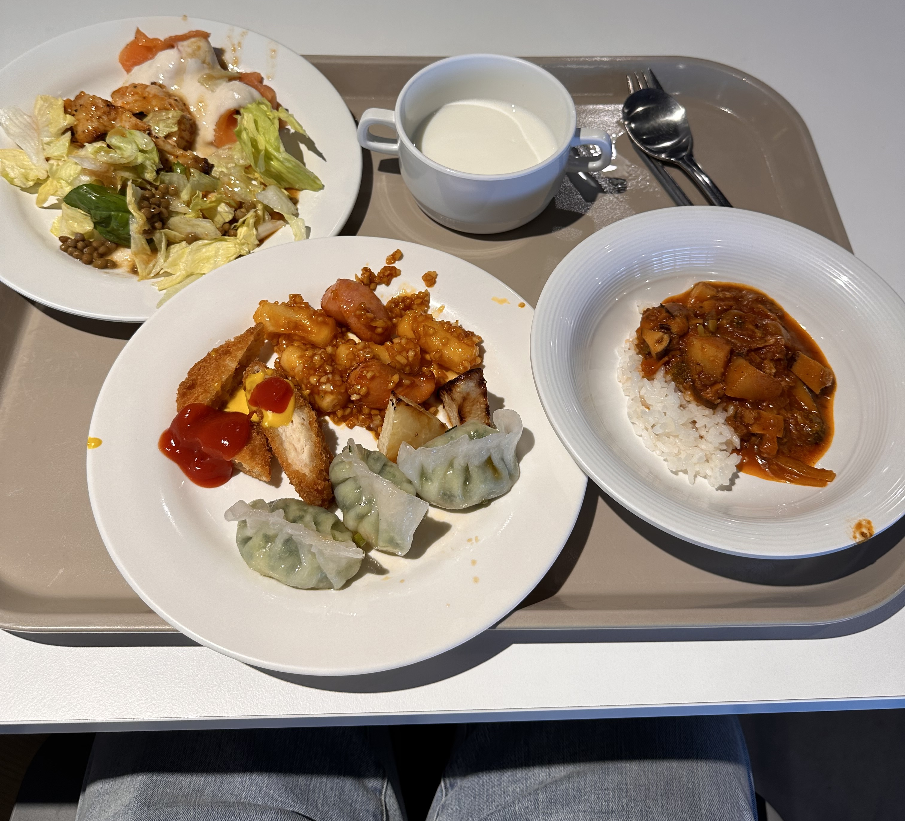
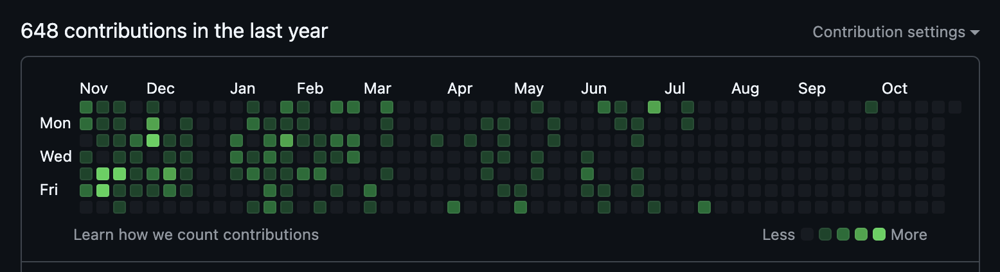

import { Span } from "@/components/typography/Paragraph";

2024년부터 본격적으로 시작했던 끝나지 않을 것만 같았던 취준 생활이 6개월 만에 끝났다. 다행히 좋은 회사에서 일할 기회가 주어졌고,
그렇게 빠르게 흘러간 3개월가량의 신입 개발자 (거의 생존기에 가까운)
생활을 기록해 보려고 한다.

# 재택근무로 시작하는 설레는 첫 출근

아직 회사 계정이 준비되지 않아서 사무실 출입이 어려웠기 때문에 집에서 근무를 시작했다. 다른 곳은 어떨지 모르겠지만 이 회사는
나와 회사 계정, 업무 PC, 그리고 보안 뱃지가 강력하게 연동되어 있기 때문에 이것들 중에 뭐 하나라도 없으면 정상적인 업무가 불가능하다.
그래서 첫날에는 회사 계정과 PC만 셋업하고 사실상 할 수 있는 게 없어서 그렇게 하루가 마무리되었던 것 같다.

계정을 준비하는 과정에서 인도인과 잠깐 이야기를 나눴는데, 인도 영어를 들으니 앞으로 내가 헤쳐 나가야 할 길이 쉽지만은 않겠다는 것을
느낄 수 있었다. 그분이 하던 영어를 겨우 반절 알아들을까 말까 했으니 말이다.

> 인도인과의 미팅 전 찍었던 사진

## 출근하고 싶어지는 오피스

누군가는 재택근무가 가능해서 좋겠다고 하겠지만, 사실 나는 하루라도 빨리 오피스에 가보고 싶었다. 바로 오피스에서 맛볼 수 있다는
아침밥과 점심밥을 먹어보고 싶었기 때문이다. 나에게 무엇을 위해 일하냐고 물어본다면, 나는 주저 없이 **"먹고 살기 위해"**라고 대답할
수 있을 정도로 음식에 진심이다.

> 오피스에서의 아침 식사

그리고 마침내 입사 이틀 차에 밥을 먹어볼 수 있었다. 매일매일 바뀌는 메뉴와 (상대적으로) 붐비지 않는 식당은 맛있는 음식 먹고 업무에
집중하라는 회사의 의도가 느껴졌다. 점심시간 직장인들의 식당 경쟁과 메뉴 고민은 유명한 난제이니 말이다. 그래서 맛은? 3개월 이상
이곳 음식을 먹어본 결과, 아주 만족스럽다. 때때로 도전적인 메뉴가 나오긴 하지만 가끔은 새로운 자극도 필요하다는 점에서 이해할 수 있었다.

# 모든 것이 새로웠던 업무 환경

대학교 졸업 전에도 인턴 기간까지 거의 3년 가까이 개발자로 일을 했었지만 이곳의 업무 환경은 모든 것이 새롭게만 다가왔다.
단순히 새로운 사무실, 새로운 사람들과 일을 한다는 것 때문에 새롭다는 게 아니라 업무에 사용하는 툴과 일하는 방식 모두 접해보지 못한 것이었다.

외부에 공개되어 있는 선에서 어떤 상황에서 어떤 부분이 다른지 간단하게 소개해 보겠다.

## 버전 관리 시스템은 Git이 국룰 아닌가요?

소프트웨어 버전 관리는 **Git**의 등장 이전과 이후로 나눠도 과언이 아닐 만큼, Git 등장 이후 어느 회사에서든 Git으로 버전 관리를
하는 것은 거의 당연시되었다. 나 역시도 Git으로 버전 관리 시스템을 이해했고, Git만을 써왔다. 하지만 이곳에서는 아니었다.
이 회사는 **Mercurial**이라는 버전 관리 시스템을 주력으로 사용하는데, Git을 사용하지 않는 만큼 당연하게도 코드 저장소로
GitHub를 사용하지 않는다. *(하지만 항상 예외는 있는 법, 몇몇 오픈소스 프로젝트들은 GitHub로 관리된다.)*

다행히(?) 나는 Git 기반 프로젝트와 관련된 업무를 진행하기 때문에 메인으로 Git을 사용하지만, 어쨌든 Mercurial도 배워야 했다.
Git과 컨셉은 다르지만 CLI 자체는 Git과 유사했기 때문에 배우는 데 큰 어려움은 없었던 것 같다.

여담이지만 그동안 깃허브에 꾸준히 커밋을 남기며 컨트리뷰션 그래프 채우는 것을 하나의 재미로 생각해 왔는데, 이제 더 이상 업무에서
깃허브를 사용하지 않게 되어 나만의 작은 깃허브 텃밭을 가꾸기가 어렵게 되었다.

> 7월 이후에 빠르게 진행된 컨트리뷰션 그래프 황폐화

## 사내수공업 개발

필연적으로 모든 소프트웨어와 기술을 자체적으로 개발해서 사용하기는 어렵다. 따라서 오픈소스 소프트웨어, 상용 소프트웨어 등을 적절히
도입해서 궁극적으로 만들고자 하는 제품의 개발 시간을 단축시키는 것이 일반적이다. 하지만 확보된 생산성에 대한 대가로 따라오는 단점 또한
존재하기 마련. 가령 사용하는 소프트웨어의 코드를 온전히 컨트룰할 수 없어서 잠재적인 보안 취약점이 생길 수도 있고, 사용하는 소프트웨어가
원치 않는 방향으로 개발될 수도 있다.

여기도 크게 다를 건 없다. 다만 굳이 위와 같은 얘기를 했다는 것은 뭔가 다른 점이 있어서이기도 하다. 완전 적절하게 원하는 기술이 없다면
당연히 외부 소프트웨어를 사용하겠지만, 기본적으로 사내에서 직접 모든 기술을 개발하는 것을 선호하는 것처럼 보인다. 그렇게 개발한 기술을
내부에서 활발하게 사용하다가 공개하기에 적합하다고 판단되면 외부로 공개하기도 한다.

이걸 다르게 생각하면, 공개되어 있지 않은 다양한 기술을 내부에서 찾을 수 있다는 뜻이 되기도 한다. 뭔가 필요한 기술이 있다면 일단 사내에서
찾으면 웬만하면 관련된 논의나 이미 개발된 기술을 손쉽게 찾아볼 수 있다. 하지만 나는 그것마저 쉽지는 않았다.

## 노트북은 거들 뿐, 클라우드 환경의 개발 환경

입사 전, 개발을 위한 PC를 선택할 수 있었다. 모델에 따라 OS는 Windows / macOS / ChromsOS / Linux 중에 선택할 수 있었다.
보통 OS에 따라 개발 환경이 호환되지 않는다거나 다양한 OS에서 오는 문제가 있을 수 있기 때문에 이를 통일하는 회사들도 많은 거로 아는데,
어떻게 이렇게 다양한 OS와 랩탑을 선택할 수 있는지에 대한 궁금증이 있었고, 이를 어떻게 극복했는지는 금세 알 수 있었다.

개발 환경을 준비하면서 가장 먼저 했던 일 중에 하나는 바로 클라우드 인스턴스를 생성하는 것이었다. 이곳에서의 거의 모든 개발 환경은 클라우드
인스턴스 혹은 브라우저를 통해 이루어진다. 따라서 OS의 다양성에서 오는 문제는 많은 부분에서 문제가 되지 않았다. (아예 없다는 뜻은 아님)

물론 앞서 언급했듯이, 이런 편리함은 사내에 있는 누군가의 땀방울로 만들어진 것이겠지만.

따라서 업무에 크롬북을 쓰던지 맥북을 쓰던지는 크게 상관이 없다. 같은 맥락으로 해외에 있는 다른 오피스에서 일을 한다거나 그런 사람들과
협업을 하는 것도 크게 문제 되지 않는다. 물론 집에서 일하는 것도 말이다.

# 활발히 변화하고 움직이는 공간, 그리고 DEI

신입 개발자로 IT회사를 다니지만 IT회사에 개발자만 있는 것은 아니기 때문에 다양한 분야의 다양한 사람들을 마주할 수 있었다.
가끔 오피스에서 진행되는 다양한 이벤트들과 무언갈 기념하는 특별한 간식, 내/외부로 들려오는 회사의 새로운 소식, 그리고 그 안에 포함되어
있다는 느낌은 나로 하여금 거대한 생물 안에 하나의 세포로써 존재한다는 느낌을 주었다.

다른 분야의 사람들과 일대일로 이야기를 하며 생각의 시야를 넓히거나, 업무 외의 이벤트 준비 등을 통해 내게 주어진 일 이외에도 다양한
방법으로 조직에 기여한다는 느낌을 받을 수 있었다. (실제로 얼마나 도움이 되는지는 몰라서 느낌이라고만 적었다.)

그리고 그동안 나와는 크게 상관없다고만 생각했던 DEI *(Diversity, Equity, Inclusion)* 에 대해 깊게 생각해 볼 수 있었다.
앞으로 개발자로 일하며 가져야 할 태도와 제품을 만들며 고민할 만한 부분, 다양한 사람들을 만나며 그들을 존중하는 법, 그리고 먼 훗날
내가 창업을 한다면 고민해 볼만한 것들(그 밖에도 삶의 다양한 부분)에 대한 생각을 해볼 수 있어 이 시기가 나에게 특별하게 느껴졌다.

# 마치며

아직 내가 이곳에서 제대로 밥값을 할까? 라는 고민과 함께 나름대로 생존을 위해 노력하고 있는 요즘이다. 글의 제목이 '생존기'인 만큼,
무언가 인사이트를 가진 글은 아니라고 생각한다. 앞으로 개발자로서, 인간으로서 더욱 성숙하고 선한 영향력을 주는 사람이 되고 싶다는 말을
끝으로 글을 마친다.